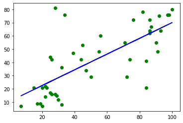
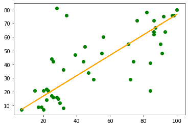
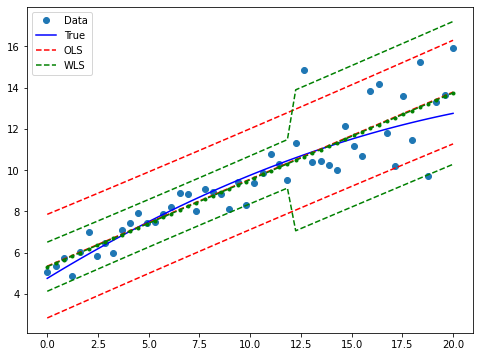
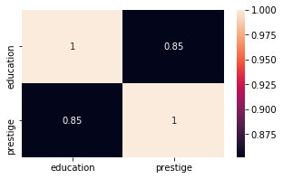

# Supervised Machine Learning: Linear Regression

[Back](../../)
#### [Download Notebook](https://github.com/albergar2/data_science_material/blob/master/ML/supervised/01-linear_regression.ipynb)


```python
import statsmodels.api as sm
import numpy as np
import pandas as pd
import matplotlib.pyplot as plt

from sklearn.linear_model import LinearRegression
from sklearn.linear_model import Lasso
from sklearn.linear_model import Ridge
from sklearn.svm import SVR
from scipy import stats
from statsmodels.sandbox.regression.predstd import wls_prediction_std
from statsmodels.iolib.table import (SimpleTable, default_txt_fmt)
from statsmodels.stats.outliers_influence import variance_inflation_factor

```

## 1. Load Data


```python
duncan_prestige = sm.datasets.get_rdataset("Duncan", "carData")
```


```python
duncan_prestige.data.head()
```


<div>
<style scoped>
    .dataframe tbody tr th:only-of-type {
        vertical-align: middle;
    }

    .dataframe tbody tr th {
        vertical-align: top;
    }

    .dataframe thead th {
        text-align: right;
    }
</style>
<table border="1" class="dataframe">
  <thead>
    <tr style="text-align: right;">
      <th></th>
      <th>type</th>
      <th>income</th>
      <th>education</th>
      <th>prestige</th>
    </tr>
  </thead>
  <tbody>
    <tr>
      <th>accountant</th>
      <td>prof</td>
      <td>62</td>
      <td>86</td>
      <td>82</td>
    </tr>
    <tr>
      <th>pilot</th>
      <td>prof</td>
      <td>72</td>
      <td>76</td>
      <td>83</td>
    </tr>
    <tr>
      <th>architect</th>
      <td>prof</td>
      <td>75</td>
      <td>92</td>
      <td>90</td>
    </tr>
    <tr>
      <th>author</th>
      <td>prof</td>
      <td>55</td>
      <td>90</td>
      <td>76</td>
    </tr>
    <tr>
      <th>chemist</th>
      <td>prof</td>
      <td>64</td>
      <td>86</td>
      <td>90</td>
    </tr>
  </tbody>
</table>
</div>


```python
y_train = duncan_prestige.data['income'].values
X_train = duncan_prestige.data['education'].values
```

## 2. OLS

- OLS help us in identifying the more significant features that can has an influence on the output. 
- The higher the t-value for the feature, the more significant the feature is to the output variable.
- If the p-value is less than 0.05(95% confidence interval) for a feature, then we can consider the feature to be significant.


```python
X = sm.add_constant(X_train)
model = sm.OLS(y_train,X)
results = model.fit()
```


```python
print(results.summary())
```

                                OLS Regression Results                            
    ==============================================================================
    Dep. Variable:                      y   R-squared:                       0.525
    Model:                            OLS   Adj. R-squared:                  0.514
    Method:                 Least Squares   F-statistic:                     47.51
    Date:                Sun, 28 Jun 2020   Prob (F-statistic):           1.84e-08
    Time:                        19:16:08   Log-Likelihood:                -190.42
    No. Observations:                  45   AIC:                             384.8
    Df Residuals:                      43   BIC:                             388.5
    Df Model:                           1                                         
    Covariance Type:            nonrobust                                         
    ==============================================================================
                     coef    std err          t      P>|t|      [0.025      0.975]
    ------------------------------------------------------------------------------
    const         10.6035      5.198      2.040      0.048       0.120      21.087
    x1             0.5949      0.086      6.893      0.000       0.421       0.769
    ==============================================================================
    Omnibus:                        9.841   Durbin-Watson:                   1.736
    Prob(Omnibus):                  0.007   Jarque-Bera (JB):               10.609
    Skew:                           0.776   Prob(JB):                      0.00497
    Kurtosis:                       4.802   Cond. No.                         123.
    ==============================================================================
    
    Warnings:
    [1] Standard Errors assume that the covariance matrix of the errors is correctly specified.


## 3. Heteroscedasticity

Heteroscedasticity means unequal scattered distribution. Heteroscedasticity is the systematic change in the spread of the residuals or errors over the range of measured values. Heteroscedasticity is the problem because Ordinary least squares (OLS) regression assumes that all residuals are drawn from a random population that has a constant variance.

* **Pure heteroscedasticity**: It refers to cases where we specify the correct model and let us observe the non-constant variance in residual plots.

* **Impure heteroscedasticity**: It refers to cases where you incorrectly specify the model, and that causes the non-constant variance. When you leave an important variable out of a model, the omitted effect is absorbed into the error term. If the effect of the omitted variable varies throughout the observed range of data, it can produce the telltale signs of heteroscedasticity in the residual plots.

We can fix heteroscedasticity with the following actions:

* **Redefining the variables**: If your model is a cross-sectional model that includes large differences between the sizes of the observations, you can find different ways to specify the model that reduces the impact of the size differential. Change the model from using the raw measure to using rates and per capita values.

* **Weighted regression**: A method that assigns each data point a weight based on the variance of its fitted value. The idea is to give small weights to observations associated with higher variances to shrink their squared residuals. Weighted regression minimizes the sum of the weighted squared residuals. When you use the correct weights, heteroscedasticity is replaced by homoscedasticity.


```python
from statsmodels.stats.diagnostic import het_breuschpagan
from statsmodels.stats.diagnostic import het_white
```


```python
bp_test = het_breuschpagan(y_train-results.predict(X), X)
```


```python
white_test = het_white(y_train.flatten()-results.predict(X),  X)
```


```python
labels = ['LM Statistic', 'LM-Test p-value', 'F-Statistic', 'F-Test p-value']
print(dict(zip(labels, bp_test)))
print(dict(zip(labels, white_test)))
```

    {'LM Statistic': 0.2864856558843082, 'LM-Test p-value': 0.5924814566555465, 'F-Statistic': 0.2755069330542666, 'F-Test p-value': 0.6023572731912976}
    {'LM Statistic': 1.3534103948377991, 'LM-Test p-value': 0.5082889482093559, 'F-Statistic': 0.6511761525631836, 'F-Test p-value': 0.5266157302284011}


Since F-Test p-value on both tests are not lower than 0.05, we can determine that the model is homocedastic.

## 4. Linear Regression

We will obtain very similar results to the ones obtained from OLS


```python
X_train = X_train.reshape(-1, 1)
y_train = y_train.reshape(-1,1)
```


```python
y_train.reshape(1,-1)
```


    array([[62, 72, 75, 55, 64, 21, 64, 80, 67, 72, 42, 76, 76, 41, 48, 76,
            53, 60, 42, 78, 29, 48, 55, 29, 21, 47, 81, 36, 22, 44, 15,  7,
            42,  9, 21, 21, 16, 16,  9, 14, 12, 17,  7, 34,  8]])


```python
lr = LinearRegression()
lr_model = lr.fit(X_train, y_train)
```


```python
lr_model.score(X_train, y_train)
```


    0.5249181546907553


```python
prediction = lr_model.predict(X_train)
```


```python
plt.scatter(X_train, y_train,  color='green')
plt.plot(X_train, prediction,  color='blue')
plt.show()
```


    

    


## 5. L1 Regularization - Lasso

Sometimes the model that is trained which will fit the data but it may fail and give a poor performance during analyzing of data (test data). This leads to overfitting. Regularization came to overcome overfitting.

Lasso Regression (Least Absolute Shrinkage and Selection Operator) adds “Absolute value of magnitude” of coefficient, as penalty term to the loss function.


```python
lasso = Lasso()
lasso.fit(X_train,y_train)
lasso.score(X_train,y_train)
```


    0.5249161767998722


```python
lasso001 = Lasso(alpha=0.01, max_iter=10e5)
lasso001.fit(X_train,y_train)
lasso001.score(X_train,y_train)
```


    0.5249181544929662


## 6. L2 Regularization - Ridge Regression

Overfitting happens when the model learns signal as well as noise in the training data and wouldn’t perform well on new/unseen data on which model wasn’t trained on. To avoid overfitting your model on training data like cross-validation sampling, reducing the number of features, pruning, regularization, etc.

Regularization adds the penalty as model complexity increases. The regularization parameter (lambda) penalizes all the parameters except intercept so that the model generalizes the data and won’t overfit.

Ridge regression adds “squared magnitude of the coefficient". Ridge regression shrinks the coefficients and it helps to reduce the model complexity and multi-collinearity.

Difference of lasso and ridge regression is that some of the coefficients can be zero i.e. some of the features are completely neglected


```python
# higher the alpha value, more restriction on the coefficients; 
# low alpha > more generalization, coefficients are barely
# restricted and in this case linear and ridge regression resembles

rr = Ridge(alpha=0.01) 
rr.fit(X_train, y_train)
rr.score(X_train,y_train)
```


    0.5249181546907209


```python
#  comparison with alpha value
rr100 = Ridge(alpha=100) 
rr100.fit(X_train, y_train)
rr100.score(X_train,y_train)
```


    0.524914716103339


## 7. Support Vector Regression

In simple linear regression, try to minimize the error rate. But in SVR, we try to fit the error within a certain threshold.

Our best fit line is the one where the hyperplane has the maximum number of points.
We are trying to do here is trying to decide a decision boundary at ‘e’ distance from the original hyperplane such that data points closest to the hyperplane or the support vectors are within that boundary line.


```python
svr_lin = SVR(kernel='linear', C=100, gamma='auto')
svr_lin_model = svr_lin.fit(X_train, y_train)
```

    /Users/albertogarcia/opt/anaconda3/envs/ds_material/lib/python3.8/site-packages/sklearn/utils/validation.py:73: DataConversionWarning: A column-vector y was passed when a 1d array was expected. Please change the shape of y to (n_samples, ), for example using ravel().
      return f(**kwargs)


```python
plt.scatter(X_train, y_train,  color='green')
plt.plot(X_train, svr_lin_model.predict(X_train),  color='orange')
plt.show()
```


    

    


## 8. Weighted Regression


```python
# Artificial data: Heteroscedasticity 2 groups
nsample = 50
x = np.linspace(0, 20, nsample)
X = np.column_stack((x, (x - 5)**2))
X = sm.add_constant(X)
beta = [5., 0.5, -0.01]
sig = 0.5
w = np.ones(nsample)
w[int(nsample * 6/10):] = 3
y_true = np.dot(X, beta)
e = np.random.normal(size=nsample)
y = y_true + sig * w * e
X = X[:,[0,1]]
```


```python
# OLS
mod_ols = sm.OLS(y, X)
res_ols = mod_ols.fit()
print(res_ols.summary())
```

                                OLS Regression Results                            
    ==============================================================================
    Dep. Variable:                      y   R-squared:                       0.816
    Model:                            OLS   Adj. R-squared:                  0.812
    Method:                 Least Squares   F-statistic:                     213.3
    Date:                Sun, 28 Jun 2020   Prob (F-statistic):           2.76e-19
    Time:                        19:27:31   Log-Likelihood:                -79.189
    No. Observations:                  50   AIC:                             162.4
    Df Residuals:                      48   BIC:                             166.2
    Df Model:                           1                                         
    Covariance Type:            nonrobust                                         
    ==============================================================================
                     coef    std err          t      P>|t|      [0.025      0.975]
    ------------------------------------------------------------------------------
    const          5.3415      0.335     15.927      0.000       4.667       6.016
    x1             0.4220      0.029     14.603      0.000       0.364       0.480
    ==============================================================================
    Omnibus:                       10.279   Durbin-Watson:                   2.200
    Prob(Omnibus):                  0.006   Jarque-Bera (JB):               19.589
    Skew:                           0.437   Prob(JB):                     5.58e-05
    Kurtosis:                       5.939   Cond. No.                         23.0
    ==============================================================================
    
    Warnings:
    [1] Standard Errors assume that the covariance matrix of the errors is correctly specified.


```python
# WLS
mod_wls = sm.WLS(y, X, weights=1./(w ** 2))
res_wls = mod_wls.fit()
print(res_wls.summary())
```

                                WLS Regression Results                            
    ==============================================================================
    Dep. Variable:                      y   R-squared:                       0.875
    Model:                            WLS   Adj. R-squared:                  0.873
    Method:                 Least Squares   F-statistic:                     336.5
    Date:                Sun, 28 Jun 2020   Prob (F-statistic):           2.51e-23
    Time:                        19:27:47   Log-Likelihood:                -63.245
    No. Observations:                  50   AIC:                             130.5
    Df Residuals:                      48   BIC:                             134.3
    Df Model:                           1                                         
    Covariance Type:            nonrobust                                         
    ==============================================================================
                     coef    std err          t      P>|t|      [0.025      0.975]
    ------------------------------------------------------------------------------
    const          5.3144      0.182     29.250      0.000       4.949       5.680
    x1             0.4214      0.023     18.343      0.000       0.375       0.468
    ==============================================================================
    Omnibus:                        0.101   Durbin-Watson:                   2.075
    Prob(Omnibus):                  0.951   Jarque-Bera (JB):                0.118
    Skew:                          -0.089   Prob(JB):                        0.943
    Kurtosis:                       2.841   Cond. No.                         14.6
    ==============================================================================
    
    Warnings:
    [1] Standard Errors assume that the covariance matrix of the errors is correctly specified.


```python
# Compare the WLS standard errors to heteroscedasticity corrected OLS standard errors
se = np.vstack([[res_wls.bse], [res_ols.bse], [res_ols.HC0_se],
                [res_ols.HC1_se], [res_ols.HC2_se], [res_ols.HC3_se]])
se = np.round(se,4)
colnames = ['x1', 'const']
rownames = ['WLS', 'OLS', 'OLS_HC0', 'OLS_HC1', 'OLS_HC3', 'OLS_HC3']
tabl = SimpleTable(se, colnames, rownames, txt_fmt=default_txt_fmt)
print(tabl)
```

    =====================
              x1   const 
    ---------------------
    WLS     0.1817  0.023
    OLS     0.3354 0.0289
    OLS_HC0 0.2133 0.0312
    OLS_HC1 0.2177 0.0319
    OLS_HC3 0.2197 0.0322
    OLS_HC3 0.2264 0.0332
    ---------------------


```python
# Calculate OLS prediction interval
covb = res_ols.cov_params()
prediction_var = res_ols.mse_resid + (X * np.dot(covb,X.T).T).sum(1)
prediction_std = np.sqrt(prediction_var)
tppf = stats.t.ppf(0.975, res_ols.df_resid)

prstd_ols, iv_l_ols, iv_u_ols = wls_prediction_std(res_ols)
prstd, iv_l, iv_u = wls_prediction_std(res_wls)
```


```python
fig, ax = plt.subplots(figsize=(8,6))
ax.plot(x, y, 'o', label="Data")
ax.plot(x, y_true, 'b-', label="True")
# OLS
ax.plot(x, res_ols.fittedvalues, 'r--')
ax.plot(x, iv_u_ols, 'r--', label="OLS")
ax.plot(x, iv_l_ols, 'r--')
# WLS
ax.plot(x, res_wls.fittedvalues, 'g--.')
ax.plot(x, iv_u, 'g--', label="WLS")
ax.plot(x, iv_l, 'g--')
ax.legend(loc="best");
```


    

    


```python
bp_test_ols = het_breuschpagan(y-res_ols.predict(X), X)
labels = ['LM Statistic', 'LM-Test p-value', 'F-Statistic', 'F-Test p-value']
print(dict(zip(labels, bp_test_ols)))
```

    {'LM Statistic': 7.24062997740727, 'LM-Test p-value': 0.007127196827086022, 'F-Statistic': 8.128048629619993, 'F-Test p-value': 0.006407136252083463}


```python
bp_test_wls = het_breuschpagan(y-res_wls.predict(X), X)
labels = ['LM Statistic', 'LM-Test p-value', 'F-Statistic', 'F-Test p-value']
print(dict(zip(labels, bp_test_wls)))
```

    {'LM Statistic': 7.165274348894885, 'LM-Test p-value': 0.00743283219904112, 'F-Statistic': 8.029307145523443, 'F-Test p-value': 0.0067121991883749305}


```python

```

## 9. Multicollinearity

Multicollinearity means independent variables are highly correlated to each other. If two explanatory variables are highly correlated, it's hard to tell, which affects the dependent variable.

**Correcting Multicollinearity**:
* **VIF**: remove variables with high VIF > 5
* **Principle Component Analysis (PCA)**: cut the number of interdependent variables to a smaller set of uncorrelated components. Instead of using correlated variables, use components in the model that have *eigenvalue>1*.
* **PROC VARCLUS**: run PROC VARCLUS and choose the variable that has minimum (1-R2) ratio within a cluster. 
* **Ridge Regression**


```python
y_train = duncan_prestige.data['income'].values
X_train = duncan_prestige.data[['education', 'prestige']]
```


```python
vif = pd.DataFrame()
vif["features"] = ['education', 'prestige']
vif["VIF Factor"] = [variance_inflation_factor(X_train.values, i) for i in range(X_train.shape[1])]
vif
```


<div>
<style scoped>
    .dataframe tbody tr th:only-of-type {
        vertical-align: middle;
    }

    .dataframe tbody tr th {
        vertical-align: top;
    }

    .dataframe thead th {
        text-align: right;
    }
</style>
<table border="1" class="dataframe">
  <thead>
    <tr style="text-align: right;">
      <th></th>
      <th>features</th>
      <th>VIF Factor</th>
    </tr>
  </thead>
  <tbody>
    <tr>
      <th>0</th>
      <td>education</td>
      <td>12.18753</td>
    </tr>
    <tr>
      <th>1</th>
      <td>prestige</td>
      <td>12.18753</td>
    </tr>
  </tbody>
</table>
</div>


```python
lr = LinearRegression()
lr_model = lr.fit(X_train, y_train)
lr_model.score(X_train, y_train)
```


    0.7023345943966101


### 9.1 VIF

It provides an index that measures how much the variance of an estimated regression coefficient is increased because of collinearity. If VIF > 5, then there is a problem with multicollinearity.

If the variance inflation factor of a predictor variable is 5 this means that variance for the coefficient of that predictor variable is 5 times as large as it would be if that predictor variable were uncorrelated with the other predictor variables.

### 9.2 PCA

PCA is a statistical procedure that transform a set of correlated variables into a set of linearly uncorrelated variables called principal components. The main idea of principal component analysis (PCA) is to reduce the dimensionality of a data set consisting of many variables correlated with each other, either heavily or lightly, while retaining the variation present in the dataset, up to the maximum extent. 

The same is done by transforming the variables to a new set of variables, which are known as the principal components (or simply, the PCs) and are orthogonal, ordered such that the retention of variation present in the original variables decreases as we move down in the order. So, in this way, the 1st principal component retains maximum variation that was present in the original components. The principal components are the eigenvectors of a covariance matrix, and hence they are orthogonal.

Main important points to be considered:
1. Normalize the data
2. Calculate the covariance matrix
3. Calculate the eigenvalues and eigenvectors
4. Choosing components and forming a feature vector
5. Forming Principal Components


```python
import seaborn as sns
from sklearn.decomposition import PCA
```


```python
X_train_like = (X_train - X_train.mean()) / X_train.std()

plt.figure(figsize=(5,3))
sns.heatmap(X_train_like.corr(), annot=True)
```


    <matplotlib.axes._subplots.AxesSubplot at 0x2b67c8e6a20>


    

    


```python
X_train_like_PCA = PCA(n_components=2)
X_train_like_PCA.fit(X_train_like.values)
```


    PCA(copy=True, iterated_power='auto', n_components=2, random_state=None,
        svd_solver='auto', tol=0.0, whiten=False)


```python
X_train_like_z = X_train_like_PCA.transform(X_train_like)
```


```python
vif = pd.DataFrame()
vif["features"] = ['PCA1', 'PCA2']
vif["VIF Factor"] = [variance_inflation_factor(X_train_like_z, i) for i in range(X_train_like_z.shape[1])]
vif
```


<div>
<style scoped>
    .dataframe tbody tr th:only-of-type {
        vertical-align: middle;
    }

    .dataframe tbody tr th {
        vertical-align: top;
    }

    .dataframe thead th {
        text-align: right;
    }
</style>
<table border="1" class="dataframe">
  <thead>
    <tr style="text-align: right;">
      <th></th>
      <th>features</th>
      <th>VIF Factor</th>
    </tr>
  </thead>
  <tbody>
    <tr>
      <th>0</th>
      <td>PCA1</td>
      <td>1.0</td>
    </tr>
    <tr>
      <th>1</th>
      <td>PCA2</td>
      <td>1.0</td>
    </tr>
  </tbody>
</table>
</div>


```python
lr = LinearRegression()
lr_model = lr.fit(X_train_like_z, y_train)
lr_model.score(X_train_like_z, y_train)
```


    0.7023345943966101


### 9.3 PROC VARCLUS


```python
from varclushi import VarClusHi
```


```python
X_train_vc = VarClusHi(X_train,maxeigval2=1,maxclus=None)
```


```python
X_train_vc.info
```


<div>
<style scoped>
    .dataframe tbody tr th:only-of-type {
        vertical-align: middle;
    }

    .dataframe tbody tr th {
        vertical-align: top;
    }

    .dataframe thead th {
        text-align: right;
    }
</style>
<table border="1" class="dataframe">
  <thead>
    <tr style="text-align: right;">
      <th></th>
      <th>Cluster</th>
      <th>N_Vars</th>
      <th>Eigval1</th>
      <th>Eigval2</th>
      <th>VarProp</th>
    </tr>
  </thead>
  <tbody>
    <tr>
      <th>0</th>
      <td>0</td>
      <td>2</td>
      <td>1.851916</td>
      <td>0.148084</td>
      <td>0.925958</td>
    </tr>
  </tbody>
</table>
</div>


```python
X_train_vc.rsquare
```


<div>
<style scoped>
    .dataframe tbody tr th:only-of-type {
        vertical-align: middle;
    }

    .dataframe tbody tr th {
        vertical-align: top;
    }

    .dataframe thead th {
        text-align: right;
    }
</style>
<table border="1" class="dataframe">
  <thead>
    <tr style="text-align: right;">
      <th></th>
      <th>Cluster</th>
      <th>Variable</th>
      <th>RS_Own</th>
      <th>RS_NC</th>
      <th>RS_Ratio</th>
    </tr>
  </thead>
  <tbody>
    <tr>
      <th>0</th>
      <td>0</td>
      <td>education</td>
      <td>0.925958</td>
      <td>0</td>
      <td>0.074042</td>
    </tr>
    <tr>
      <th>1</th>
      <td>0</td>
      <td>prestige</td>
      <td>0.925958</td>
      <td>0</td>
      <td>0.074042</td>
    </tr>
  </tbody>
</table>
</div>


```python
X_train_center = (X_train - X_train.mean())
X_train_interact = (X_train_ce['education'] * X_train_ce['prestige']).values
```


```python
lr = LinearRegression()
lr_model = lr.fit(X_train_interact.reshape(-1, 1), y_train.reshape(-1, 1))
lr_model.score(X_train_interact.reshape(-1, 1), y_train.reshape(-1, 1))
```


    0.5859853337918666


```python

```
