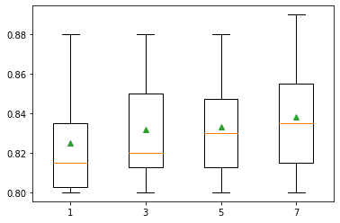
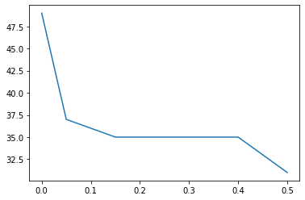
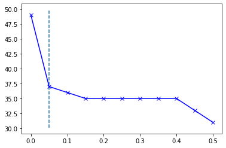

[Back](../../)
#### [Download Notebook](https://github.com/albergar2/data_science_material/blob/master/01_Data_Cleaning.ipynb)


```python
import pandas as pd
import numpy as np
```

## 1. Basic Functions


```python
from sklearn.datasets import load_iris

iris = load_iris()
df_iris = pd.DataFrame(data= np.c_[iris['data'], iris['target']],
                       columns= iris['feature_names'] + ['target'])

df_iris.head()
```


<div>
<style scoped>
    .dataframe tbody tr th:only-of-type {
        vertical-align: middle;
    }

    .dataframe tbody tr th {
        vertical-align: top;
    }

    .dataframe thead th {
        text-align: right;
    }
</style>
<table border="1" class="dataframe">
  <thead>
    <tr style="text-align: right;">
      <th></th>
      <th>sepal length (cm)</th>
      <th>sepal width (cm)</th>
      <th>petal length (cm)</th>
      <th>petal width (cm)</th>
      <th>target</th>
    </tr>
  </thead>
  <tbody>
    <tr>
      <th>0</th>
      <td>5.1</td>
      <td>3.5</td>
      <td>1.4</td>
      <td>0.2</td>
      <td>0.0</td>
    </tr>
    <tr>
      <th>1</th>
      <td>4.9</td>
      <td>3.0</td>
      <td>1.4</td>
      <td>0.2</td>
      <td>0.0</td>
    </tr>
    <tr>
      <th>2</th>
      <td>4.7</td>
      <td>3.2</td>
      <td>1.3</td>
      <td>0.2</td>
      <td>0.0</td>
    </tr>
    <tr>
      <th>3</th>
      <td>4.6</td>
      <td>3.1</td>
      <td>1.5</td>
      <td>0.2</td>
      <td>0.0</td>
    </tr>
    <tr>
      <th>4</th>
      <td>5.0</td>
      <td>3.6</td>
      <td>1.4</td>
      <td>0.2</td>
      <td>0.0</td>
    </tr>
  </tbody>
</table>
</div>


### 1.1 Constant Values


```python
print(df_iris.shape)

for i in df_iris.columns:
    if df_iris[i].nunique()==1:
        df_iris.drop(i, axis=1, inplace=True)
        
print(df_iris.shape)
```

    (150, 5)
    (150, 5)


### 1.2 Duplicates


```python
print(df_iris.shape)
df_iris.drop_duplicates(inplace=True)
print(df_iris.shape)
```

    (150, 5)
    (149, 5)


### 1.3 Missing Data


```python
df_missings = pd.read_csv('data/missings.csv', header=None)
df_missings.head()
```


<div>
<style scoped>
    .dataframe tbody tr th:only-of-type {
        vertical-align: middle;
    }

    .dataframe tbody tr th {
        vertical-align: top;
    }

    .dataframe thead th {
        text-align: right;
    }
</style>
<table border="1" class="dataframe">
  <thead>
    <tr style="text-align: right;">
      <th></th>
      <th>0</th>
      <th>1</th>
      <th>2</th>
      <th>3</th>
      <th>4</th>
      <th>5</th>
      <th>6</th>
      <th>7</th>
      <th>8</th>
      <th>9</th>
      <th>...</th>
      <th>18</th>
      <th>19</th>
      <th>20</th>
      <th>21</th>
      <th>22</th>
      <th>23</th>
      <th>24</th>
      <th>25</th>
      <th>26</th>
      <th>27</th>
    </tr>
  </thead>
  <tbody>
    <tr>
      <th>0</th>
      <td>2</td>
      <td>1</td>
      <td>530101</td>
      <td>38.50</td>
      <td>66</td>
      <td>28</td>
      <td>3</td>
      <td>3</td>
      <td>?</td>
      <td>2</td>
      <td>...</td>
      <td>45.0</td>
      <td>8.4</td>
      <td>?</td>
      <td>?</td>
      <td>2</td>
      <td>2</td>
      <td>11300</td>
      <td>0</td>
      <td>0</td>
      <td>2</td>
    </tr>
    <tr>
      <th>1</th>
      <td>1</td>
      <td>1</td>
      <td>534817</td>
      <td>39.2</td>
      <td>88</td>
      <td>20</td>
      <td>?</td>
      <td>?</td>
      <td>4</td>
      <td>1</td>
      <td>...</td>
      <td>50</td>
      <td>85</td>
      <td>2</td>
      <td>2</td>
      <td>3</td>
      <td>2</td>
      <td>2208</td>
      <td>0</td>
      <td>0</td>
      <td>2</td>
    </tr>
    <tr>
      <th>2</th>
      <td>2</td>
      <td>1</td>
      <td>530334</td>
      <td>38.30</td>
      <td>40</td>
      <td>24</td>
      <td>1</td>
      <td>1</td>
      <td>3</td>
      <td>1</td>
      <td>...</td>
      <td>33.0</td>
      <td>6.7</td>
      <td>?</td>
      <td>?</td>
      <td>1</td>
      <td>2</td>
      <td>0</td>
      <td>0</td>
      <td>0</td>
      <td>1</td>
    </tr>
    <tr>
      <th>3</th>
      <td>1</td>
      <td>9</td>
      <td>5290409</td>
      <td>39.10</td>
      <td>164</td>
      <td>84</td>
      <td>4</td>
      <td>1</td>
      <td>6</td>
      <td>2</td>
      <td>...</td>
      <td>48.0</td>
      <td>7.2</td>
      <td>3</td>
      <td>5.3</td>
      <td>2</td>
      <td>1</td>
      <td>2208</td>
      <td>0</td>
      <td>0</td>
      <td>1</td>
    </tr>
    <tr>
      <th>4</th>
      <td>2</td>
      <td>1</td>
      <td>530255</td>
      <td>37.30</td>
      <td>104</td>
      <td>35</td>
      <td>?</td>
      <td>?</td>
      <td>6</td>
      <td>2</td>
      <td>...</td>
      <td>74.0</td>
      <td>7.4</td>
      <td>?</td>
      <td>?</td>
      <td>2</td>
      <td>2</td>
      <td>4300</td>
      <td>0</td>
      <td>0</td>
      <td>2</td>
    </tr>
  </tbody>
</table>
<p>5 rows × 28 columns</p>
</div>


```python
df_missings = df_missings.replace('?', np.nan)

pd.DataFrame(data={'missings':df_missings.isnull().sum(), 
                   'percent_missing': df_missings.isnull().sum() / len(df_missings)}, 
             index=df_missings.columns)
```


<div>
<style scoped>
    .dataframe tbody tr th:only-of-type {
        vertical-align: middle;
    }

    .dataframe tbody tr th {
        vertical-align: top;
    }

    .dataframe thead th {
        text-align: right;
    }
</style>
<table border="1" class="dataframe">
  <thead>
    <tr style="text-align: right;">
      <th></th>
      <th>missings</th>
      <th>percent_missing</th>
    </tr>
  </thead>
  <tbody>
    <tr>
      <th>0</th>
      <td>1</td>
      <td>0.003333</td>
    </tr>
    <tr>
      <th>1</th>
      <td>0</td>
      <td>0.000000</td>
    </tr>
    <tr>
      <th>2</th>
      <td>0</td>
      <td>0.000000</td>
    </tr>
    <tr>
      <th>3</th>
      <td>60</td>
      <td>0.200000</td>
    </tr>
    <tr>
      <th>4</th>
      <td>24</td>
      <td>0.080000</td>
    </tr>
    <tr>
      <th>5</th>
      <td>58</td>
      <td>0.193333</td>
    </tr>
    <tr>
      <th>6</th>
      <td>56</td>
      <td>0.186667</td>
    </tr>
    <tr>
      <th>7</th>
      <td>69</td>
      <td>0.230000</td>
    </tr>
    <tr>
      <th>8</th>
      <td>47</td>
      <td>0.156667</td>
    </tr>
    <tr>
      <th>9</th>
      <td>32</td>
      <td>0.106667</td>
    </tr>
    <tr>
      <th>10</th>
      <td>55</td>
      <td>0.183333</td>
    </tr>
    <tr>
      <th>11</th>
      <td>44</td>
      <td>0.146667</td>
    </tr>
    <tr>
      <th>12</th>
      <td>56</td>
      <td>0.186667</td>
    </tr>
    <tr>
      <th>13</th>
      <td>104</td>
      <td>0.346667</td>
    </tr>
    <tr>
      <th>14</th>
      <td>106</td>
      <td>0.353333</td>
    </tr>
    <tr>
      <th>15</th>
      <td>247</td>
      <td>0.823333</td>
    </tr>
    <tr>
      <th>16</th>
      <td>102</td>
      <td>0.340000</td>
    </tr>
    <tr>
      <th>17</th>
      <td>118</td>
      <td>0.393333</td>
    </tr>
    <tr>
      <th>18</th>
      <td>29</td>
      <td>0.096667</td>
    </tr>
    <tr>
      <th>19</th>
      <td>33</td>
      <td>0.110000</td>
    </tr>
    <tr>
      <th>20</th>
      <td>165</td>
      <td>0.550000</td>
    </tr>
    <tr>
      <th>21</th>
      <td>198</td>
      <td>0.660000</td>
    </tr>
    <tr>
      <th>22</th>
      <td>1</td>
      <td>0.003333</td>
    </tr>
    <tr>
      <th>23</th>
      <td>0</td>
      <td>0.000000</td>
    </tr>
    <tr>
      <th>24</th>
      <td>0</td>
      <td>0.000000</td>
    </tr>
    <tr>
      <th>25</th>
      <td>0</td>
      <td>0.000000</td>
    </tr>
    <tr>
      <th>26</th>
      <td>0</td>
      <td>0.000000</td>
    </tr>
    <tr>
      <th>27</th>
      <td>0</td>
      <td>0.000000</td>
    </tr>
  </tbody>
</table>
</div>


```python
df_missings[3] = df_missings[3].astype(float)
df_missings[3] = df_missings[3].fillna(df_missings[3].mean())
df_missings[5] = df_missings[5].astype(float)
df_missings[5] = df_missings[5].fillna(df_missings[5].median())
```


```python
from sklearn.impute import SimpleImputer

for i in df_missings.columns:
    df_missings[i] = df_missings[i].astype(float)
    
df_missings_val = df_missings.values
print('Missing: %d' % sum(np.isnan(df_missings_val).flatten()))

imputer = SimpleImputer(strategy='mean')
df_missings_val = imputer.fit_transform(df_missings_val)
print('Missing: %d' % sum(np.isnan(df_missings_val).flatten()))
```

    Missing: 1487
    Missing: 0


#### Categorical data


```python
cat_data = pd.read_csv('data/categorical_input.csv', header=None)
cat_data.head()
```


<div>
<style scoped>
    .dataframe tbody tr th:only-of-type {
        vertical-align: middle;
    }

    .dataframe tbody tr th {
        vertical-align: top;
    }

    .dataframe thead th {
        text-align: right;
    }
</style>
<table border="1" class="dataframe">
  <thead>
    <tr style="text-align: right;">
      <th></th>
      <th>0</th>
      <th>1</th>
      <th>2</th>
      <th>3</th>
      <th>4</th>
      <th>5</th>
      <th>6</th>
      <th>7</th>
      <th>8</th>
      <th>9</th>
    </tr>
  </thead>
  <tbody>
    <tr>
      <th>0</th>
      <td>'40-49'</td>
      <td>'premeno'</td>
      <td>'15-19'</td>
      <td>'0-2'</td>
      <td>'yes'</td>
      <td>'3'</td>
      <td>'right'</td>
      <td>'left_up'</td>
      <td>'no'</td>
      <td>'recurrence-events'</td>
    </tr>
    <tr>
      <th>1</th>
      <td>'50-59'</td>
      <td>'ge40'</td>
      <td>'15-19'</td>
      <td>'0-2'</td>
      <td>'no'</td>
      <td>'1'</td>
      <td>'right'</td>
      <td>'central'</td>
      <td>'no'</td>
      <td>'no-recurrence-events'</td>
    </tr>
    <tr>
      <th>2</th>
      <td>'50-59'</td>
      <td>'ge40'</td>
      <td>'35-39'</td>
      <td>'0-2'</td>
      <td>'no'</td>
      <td>'2'</td>
      <td>'left'</td>
      <td>'left_low'</td>
      <td>'no'</td>
      <td>'recurrence-events'</td>
    </tr>
    <tr>
      <th>3</th>
      <td>'40-49'</td>
      <td>'premeno'</td>
      <td>'35-39'</td>
      <td>'0-2'</td>
      <td>'yes'</td>
      <td>'3'</td>
      <td>'right'</td>
      <td>'left_low'</td>
      <td>'yes'</td>
      <td>'no-recurrence-events'</td>
    </tr>
    <tr>
      <th>4</th>
      <td>'40-49'</td>
      <td>'premeno'</td>
      <td>'30-34'</td>
      <td>'3-5'</td>
      <td>'yes'</td>
      <td>'2'</td>
      <td>'left'</td>
      <td>'right_up'</td>
      <td>'no'</td>
      <td>'recurrence-events'</td>
    </tr>
  </tbody>
</table>
</div>


```python
pd.DataFrame(data={'missings':cat_data.isnull().sum(), 
                   'percent_missing': cat_data.isnull().sum() / len(cat_data)}, 
             index=cat_data.columns)
```


<div>
<style scoped>
    .dataframe tbody tr th:only-of-type {
        vertical-align: middle;
    }

    .dataframe tbody tr th {
        vertical-align: top;
    }

    .dataframe thead th {
        text-align: right;
    }
</style>
<table border="1" class="dataframe">
  <thead>
    <tr style="text-align: right;">
      <th></th>
      <th>missings</th>
      <th>percent_missing</th>
    </tr>
  </thead>
  <tbody>
    <tr>
      <th>0</th>
      <td>0</td>
      <td>0.000000</td>
    </tr>
    <tr>
      <th>1</th>
      <td>0</td>
      <td>0.000000</td>
    </tr>
    <tr>
      <th>2</th>
      <td>0</td>
      <td>0.000000</td>
    </tr>
    <tr>
      <th>3</th>
      <td>0</td>
      <td>0.000000</td>
    </tr>
    <tr>
      <th>4</th>
      <td>8</td>
      <td>0.027972</td>
    </tr>
    <tr>
      <th>5</th>
      <td>0</td>
      <td>0.000000</td>
    </tr>
    <tr>
      <th>6</th>
      <td>0</td>
      <td>0.000000</td>
    </tr>
    <tr>
      <th>7</th>
      <td>1</td>
      <td>0.003497</td>
    </tr>
    <tr>
      <th>8</th>
      <td>0</td>
      <td>0.000000</td>
    </tr>
    <tr>
      <th>9</th>
      <td>0</td>
      <td>0.000000</td>
    </tr>
  </tbody>
</table>
</div>


```python
for i in cat_data.columns:
    cat_data[i] = cat_data[i].fillna(cat_data[i].mode()[0])
```

#### SimpleImputer + Regression + Crossvalidation


```python
from sklearn.impute import SimpleImputer
from sklearn.preprocessing import MinMaxScaler
from sklearn.model_selection import cross_val_score
from sklearn.model_selection import RepeatedStratifiedKFold
from sklearn.linear_model import LogisticRegression
from sklearn.pipeline import Pipeline
from matplotlib import pyplot as plt

results = list()

df_missings_val = df_missings.values
ix = [i for i in range(df_missings_val.shape[1]) if i != 23]
X, y = df_missings_val[:, ix], df_missings_val[:, 23]

strategies = ['mean', 'median', 'most_frequent', 'constant']

for s in strategies:
    steps = list()
    steps.append(('imputer', SimpleImputer(strategy=s)))
    steps.append(('scaler', MinMaxScaler()))
    steps.append(('model', LogisticRegression()))
    pipeline = Pipeline(steps=steps)
  
    cv = RepeatedStratifiedKFold(n_splits=3, n_repeats=2, random_state=1)
    scores = cross_val_score(pipeline, X, y, scoring='accuracy', cv=cv, n_jobs=-1)
    results.append(scores)
    print('>%s %.3f (%.3f)' % (s, np.mean(scores), np.std(scores)))

plt.boxplot(results, labels=strategies, showmeans=True)
plt.show()
```

    >mean 0.818 (0.023)
    >median 0.823 (0.028)
    >most_frequent 0.832 (0.033)
    >constant 0.840 (0.013)


    

    


#### KNNImputer + Regression + Crossvalidation

Each sample’s missing values are imputed using the mean value from `n_neighbors`


```python
from sklearn.impute import KNNImputer

results = list()
strategies = [str(i) for i in [1,3,5,7]]

for s in strategies:
    steps = list()
    steps.append(('imputer',  KNNImputer(n_neighbors=int(s))))
    steps.append(('scaler', MinMaxScaler()))
    steps.append(('model', LogisticRegression()))
    pipeline = Pipeline(steps=steps)
  
    cv = RepeatedStratifiedKFold(n_splits=3, n_repeats=2, random_state=1)
    scores = cross_val_score(pipeline, X, y, scoring='accuracy', cv=cv, n_jobs=-1)
    results.append(scores)
    print('> %s %.3f (%.3f)' % (s, np.mean(scores), np.std(scores)))

plt.boxplot(results, labels=strategies, showmeans=True)
plt.show()
```

    > 1 0.825 (0.028)
    > 3 0.832 (0.029)
    > 5 0.833 (0.027)
    > 7 0.838 (0.030)


    

    


## 2. Outliers

### 2.1 Manual Gaussian Data


```python
from numpy.random import seed
from numpy.random import randn
```


```python
seed(1)
data = 5 * randn(1000) + 50 

mean, std = np.mean(data), np.std(data)
print('mean=%.3f stdv=%.3f' % (mean, std))
```

    mean=50.194 stdv=4.905


```python
# define outliers
cut_off = std * 3
lower, upper = mean - cut_off, mean + cut_off
outliers = [x for x in data if x < lower or x > upper]
print('Identified outliers: %d' % len(outliers))
```

    Identified outliers: 4


```python
clean_data = [x for x in data if x >= lower and x <= upper]
print('Non-outlier observations: %d' % len(clean_data))
```

    Non-outlier observations: 996


### 2.2 Manual Non Gaussian Data


```python
# calculate interquartile range
q25, q75 = np.percentile(data, 25), np.percentile(data, 75)
iqr = q75 - q25
print('Percentile: 25th=%.3f, 75th=%.3f, IQR=%.3f' % (q25, q75, iqr))
```

    Percentile: 25th=46.999, 75th=53.520, IQR=6.521


```python
# calculate the outlier cutoff
cut_off = iqr * 1.5
lower, upper = q25 - cut_off, q75 + cut_off

# identify outliers
outliers = [x for x in data if x < lower or x > upper]
print('Identified outliers: %d' % len(outliers))
```

    Identified outliers: 9


```python
# remove outliers
clean_data = [x for x in data if x >= lower and x <= upper]
print('Non-outlier observations: %d' % len(clean_data))
```

    Non-outlier observations: 991


### 2.3 LocalOutlierFactor

LocalOutlierFactor compares the density of each sample with the density of its nearest neighbors.


```python
from sklearn.neighbors import LocalOutlierFactor
```


```python
data = df_iris.values
X, y = data[:, :-1], data[:, -1]
print(f'Raw observations:{len(X)}')
```

    Raw observations:149


```python
lof = LocalOutlierFactor()
lof_result = lof.fit_predict(X)
mask = lof_result != -1
print(f'Identified outliers: {np.size(mask) - np.count_nonzero(mask)}')
```

    Identified outliers: 6


```python
X_clean, y_clean = X[mask], y[mask]
print('Non-outlier observations: %d' % len(X_clean))
```

    Non-outlier observations: 143


## 3. Variance Threshold
Remove those variables with a low variance, meaning they have a low numbre of unique values. 


```python
from sklearn.feature_selection import VarianceThreshold
```


```python
df = pd.read_csv('data/data_cleaning.csv', header=None)
print(f'Shape:{df.shape}')
```

    Shape:(937, 50)


```python
df.head()
```


<div>
<style scoped>
    .dataframe tbody tr th:only-of-type {
        vertical-align: middle;
    }

    .dataframe tbody tr th {
        vertical-align: top;
    }

    .dataframe thead th {
        text-align: right;
    }
</style>
<table border="1" class="dataframe">
  <thead>
    <tr style="text-align: right;">
      <th></th>
      <th>0</th>
      <th>1</th>
      <th>2</th>
      <th>3</th>
      <th>4</th>
      <th>5</th>
      <th>6</th>
      <th>7</th>
      <th>8</th>
      <th>9</th>
      <th>...</th>
      <th>40</th>
      <th>41</th>
      <th>42</th>
      <th>43</th>
      <th>44</th>
      <th>45</th>
      <th>46</th>
      <th>47</th>
      <th>48</th>
      <th>49</th>
    </tr>
  </thead>
  <tbody>
    <tr>
      <th>0</th>
      <td>1</td>
      <td>2558</td>
      <td>1506.09</td>
      <td>456.63</td>
      <td>90</td>
      <td>6395000.0</td>
      <td>40.88</td>
      <td>7.89</td>
      <td>29780.0</td>
      <td>0.19</td>
      <td>...</td>
      <td>2850.00</td>
      <td>1000.00</td>
      <td>763.16</td>
      <td>135.46</td>
      <td>3.73</td>
      <td>0</td>
      <td>33243.19</td>
      <td>65.74</td>
      <td>7.95</td>
      <td>1</td>
    </tr>
    <tr>
      <th>1</th>
      <td>2</td>
      <td>22325</td>
      <td>79.11</td>
      <td>841.03</td>
      <td>180</td>
      <td>55812500.0</td>
      <td>51.11</td>
      <td>1.21</td>
      <td>61900.0</td>
      <td>0.02</td>
      <td>...</td>
      <td>5750.00</td>
      <td>11500.00</td>
      <td>9593.48</td>
      <td>1648.80</td>
      <td>0.60</td>
      <td>0</td>
      <td>51572.04</td>
      <td>65.73</td>
      <td>6.26</td>
      <td>0</td>
    </tr>
    <tr>
      <th>2</th>
      <td>3</td>
      <td>115</td>
      <td>1449.85</td>
      <td>608.43</td>
      <td>88</td>
      <td>287500.0</td>
      <td>40.42</td>
      <td>7.34</td>
      <td>3340.0</td>
      <td>0.18</td>
      <td>...</td>
      <td>1400.00</td>
      <td>250.00</td>
      <td>150.00</td>
      <td>45.13</td>
      <td>9.33</td>
      <td>1</td>
      <td>31692.84</td>
      <td>65.81</td>
      <td>7.84</td>
      <td>1</td>
    </tr>
    <tr>
      <th>3</th>
      <td>4</td>
      <td>1201</td>
      <td>1562.53</td>
      <td>295.65</td>
      <td>66</td>
      <td>3002500.0</td>
      <td>42.40</td>
      <td>7.97</td>
      <td>18030.0</td>
      <td>0.19</td>
      <td>...</td>
      <td>6041.52</td>
      <td>761.58</td>
      <td>453.21</td>
      <td>144.97</td>
      <td>13.33</td>
      <td>1</td>
      <td>37696.21</td>
      <td>65.67</td>
      <td>8.07</td>
      <td>1</td>
    </tr>
    <tr>
      <th>4</th>
      <td>5</td>
      <td>312</td>
      <td>950.27</td>
      <td>440.86</td>
      <td>37</td>
      <td>780000.0</td>
      <td>41.43</td>
      <td>7.03</td>
      <td>3350.0</td>
      <td>0.17</td>
      <td>...</td>
      <td>1320.04</td>
      <td>710.63</td>
      <td>512.54</td>
      <td>109.16</td>
      <td>2.58</td>
      <td>0</td>
      <td>29038.17</td>
      <td>65.66</td>
      <td>7.35</td>
      <td>0</td>
    </tr>
  </tbody>
</table>
<p>5 rows × 50 columns</p>
</div>


```python
thresholds = np.arange(0.0, 0.55, 0.05)

results = list()
for t in thresholds:
    transform = VarianceThreshold(threshold=t)
    X_sel = transform.fit_transform(df)
    n_features = X_sel.shape[1]
    print('Threshold=%.2f, Features=%d' % (t, n_features))
    results.append(n_features)
```

    Threshold=0.00, Features=49
    Threshold=0.05, Features=37
    Threshold=0.10, Features=36
    Threshold=0.15, Features=35
    Threshold=0.20, Features=35
    Threshold=0.25, Features=35
    Threshold=0.30, Features=35
    Threshold=0.35, Features=35
    Threshold=0.40, Features=35
    Threshold=0.45, Features=33
    Threshold=0.50, Features=31


```python
from matplotlib import pyplot as plt

plt.plot(thresholds, results)
plt.show()
```


    

    


```python
from kneed import KneeLocator

kn = KneeLocator(thresholds, results, curve='convex', direction='decreasing')
plt.plot(thresholds, results, 'bx-')
plt.vlines(kn.knee, plt.ylim()[0], plt.ylim()[1], linestyles='dashed')
```


    <matplotlib.collections.LineCollection at 0x7fe98ca93e50>


    

    


```python

```
