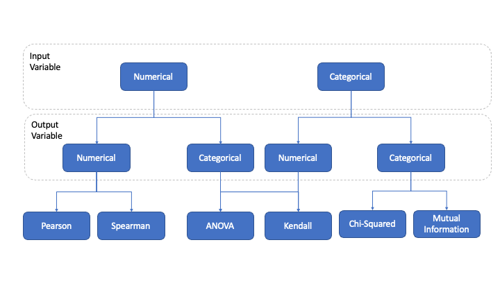
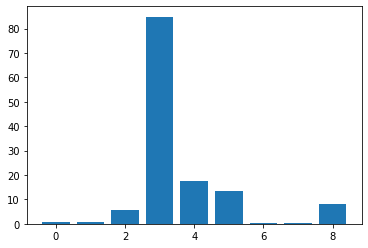
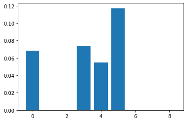
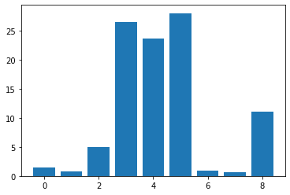
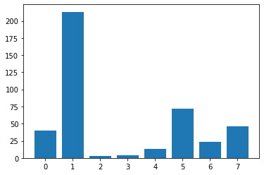
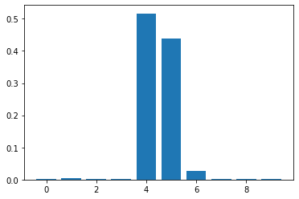
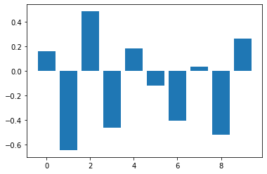

[Back](../../)
#### [Download Notebook](https://github.com/albergar2/data_science_material/blob/master/02_Feature_Selection.ipynb)


```python
import pandas as pd
import numpy as np
from matplotlib import pyplot as plt
```

## 1. Filter

Select subsets of features according to their relationship with the target variable. It is based on a statistics approach.



### 1.1 Categorical Input: Chi-Squared

Statistical test to see the independence of 2 categorical variables, the variables that are independent of the target variable would be the candidates to be eliminated.


```python
from sklearn.feature_selection import SelectKBest
from sklearn.feature_selection import chi2
from sklearn.preprocessing import LabelEncoder
from sklearn.preprocessing import OrdinalEncoder
```


```python
cat_data = pd.read_csv('data/categorical_input.csv', header=None)
cat_data.head()
```


<div>
<style scoped>
    .dataframe tbody tr th:only-of-type {
        vertical-align: middle;
    }

    .dataframe tbody tr th {
        vertical-align: top;
    }

    .dataframe thead th {
        text-align: right;
    }
</style>
<table border="1" class="dataframe">
  <thead>
    <tr style="text-align: right;">
      <th></th>
      <th>0</th>
      <th>1</th>
      <th>2</th>
      <th>3</th>
      <th>4</th>
      <th>5</th>
      <th>6</th>
      <th>7</th>
      <th>8</th>
      <th>9</th>
    </tr>
  </thead>
  <tbody>
    <tr>
      <th>0</th>
      <td>'40-49'</td>
      <td>'premeno'</td>
      <td>'15-19'</td>
      <td>'0-2'</td>
      <td>'yes'</td>
      <td>'3'</td>
      <td>'right'</td>
      <td>'left_up'</td>
      <td>'no'</td>
      <td>'recurrence-events'</td>
    </tr>
    <tr>
      <th>1</th>
      <td>'50-59'</td>
      <td>'ge40'</td>
      <td>'15-19'</td>
      <td>'0-2'</td>
      <td>'no'</td>
      <td>'1'</td>
      <td>'right'</td>
      <td>'central'</td>
      <td>'no'</td>
      <td>'no-recurrence-events'</td>
    </tr>
    <tr>
      <th>2</th>
      <td>'50-59'</td>
      <td>'ge40'</td>
      <td>'35-39'</td>
      <td>'0-2'</td>
      <td>'no'</td>
      <td>'2'</td>
      <td>'left'</td>
      <td>'left_low'</td>
      <td>'no'</td>
      <td>'recurrence-events'</td>
    </tr>
    <tr>
      <th>3</th>
      <td>'40-49'</td>
      <td>'premeno'</td>
      <td>'35-39'</td>
      <td>'0-2'</td>
      <td>'yes'</td>
      <td>'3'</td>
      <td>'right'</td>
      <td>'left_low'</td>
      <td>'yes'</td>
      <td>'no-recurrence-events'</td>
    </tr>
    <tr>
      <th>4</th>
      <td>'40-49'</td>
      <td>'premeno'</td>
      <td>'30-34'</td>
      <td>'3-5'</td>
      <td>'yes'</td>
      <td>'2'</td>
      <td>'left'</td>
      <td>'right_up'</td>
      <td>'no'</td>
      <td>'recurrence-events'</td>
    </tr>
  </tbody>
</table>
</div>


```python
pd.DataFrame(data={'missings':cat_data.isnull().sum(), 
                   'percent_missing': cat_data.isnull().sum() / len(cat_data)}, 
             index=cat_data.columns)
```


<div>
<style scoped>
    .dataframe tbody tr th:only-of-type {
        vertical-align: middle;
    }

    .dataframe tbody tr th {
        vertical-align: top;
    }

    .dataframe thead th {
        text-align: right;
    }
</style>
<table border="1" class="dataframe">
  <thead>
    <tr style="text-align: right;">
      <th></th>
      <th>missings</th>
      <th>percent_missing</th>
    </tr>
  </thead>
  <tbody>
    <tr>
      <th>0</th>
      <td>0</td>
      <td>0.0</td>
    </tr>
    <tr>
      <th>1</th>
      <td>0</td>
      <td>0.0</td>
    </tr>
    <tr>
      <th>2</th>
      <td>0</td>
      <td>0.0</td>
    </tr>
    <tr>
      <th>3</th>
      <td>0</td>
      <td>0.0</td>
    </tr>
    <tr>
      <th>4</th>
      <td>0</td>
      <td>0.0</td>
    </tr>
    <tr>
      <th>5</th>
      <td>0</td>
      <td>0.0</td>
    </tr>
    <tr>
      <th>6</th>
      <td>0</td>
      <td>0.0</td>
    </tr>
    <tr>
      <th>7</th>
      <td>0</td>
      <td>0.0</td>
    </tr>
    <tr>
      <th>8</th>
      <td>0</td>
      <td>0.0</td>
    </tr>
    <tr>
      <th>9</th>
      <td>0</td>
      <td>0.0</td>
    </tr>
  </tbody>
</table>
</div>


```python
for i in cat_data.columns:
    cat_data[i] = cat_data[i].fillna(cat_data[i].mode()[0])
```


```python
data = cat_data.values
X = data[:, :-1]
y = data[:,-1]
```


```python
# Encode categories based on appearance
oe = OrdinalEncoder()
X = oe.fit_transform(X)

# Encode target for binary clasiffication
le = LabelEncoder()
y = le.fit_transform(y)
```


```python
fs = SelectKBest(score_func=chi2, k='all')
fs.fit(X, y)
X_fs = fs.transform(X)

# The greater the scores are the better, because more dependant are from each other
for i in range(len(fs.scores_)):
  print('Feature %d: %f' % (i, fs.scores_[i]))

plt.bar([i for i in range(len(fs.scores_))], fs.scores_)
plt.show()
```

    Feature 0: 0.563284
    Feature 1: 0.712378
    Feature 2: 5.534357
    Feature 3: 84.840985
    Feature 4: 17.621176
    Feature 5: 13.272755
    Feature 6: 0.522775
    Feature 7: 0.425232
    Feature 8: 8.197246


    

    


### 1.2 Categorical Input: Mutual Information

It measures the mutual dependence of two variables, that is, it measures the reduction of the uncertainty (entropy) of a random variable, X, due to the knowledge of the value of another random variable Y. For example, if X and Y are independent, then knowing X does not give information about Y and vice versa, so their mutual information is zero.


```python
from sklearn.feature_selection import SelectKBest
from sklearn.preprocessing import LabelEncoder
from sklearn.preprocessing import OrdinalEncoder
from sklearn.feature_selection import mutual_info_classif

cat_data = pd.read_csv('data/categorical_input.csv', header=None)

for i in cat_data.columns:
    cat_data[i] = cat_data[i].fillna(cat_data[i].mode()[0])

data = cat_data.values
X = data[:, :-1]
y = data[:,-1]

# Encode categories based on appearance
oe = OrdinalEncoder()
X = oe.fit_transform(X)

# Encode target for binary classification
le = LabelEncoder()
y = le.fit_transform(y)

fs = SelectKBest(score_func=mutual_info_classif, k='all')
fs.fit(X, y)
X_fs = fs.transform(X)

# The greater the scores are the better, because more dependant are from each other
for i in range(len(fs.scores_)):
    print('Feature %d: %f' % (i, fs.scores_[i]))

plt.bar([i for i in range(len(fs.scores_))], fs.scores_)
plt.show()
```

    Feature 0: 0.068533
    Feature 1: 0.000000
    Feature 2: 0.000000
    Feature 3: 0.074196
    Feature 4: 0.054834
    Feature 5: 0.117169
    Feature 6: 0.000000
    Feature 7: 0.000000
    Feature 8: 0.000000


    

    


### 1.3 Numerical Input: ANOVA

ANOVA: means analysis of variance. It is a statistical technique that indicates whether two variables (one independent and one dependent) are related based on whether the means of the dependent variable are different in the categories or groups of the independent variable. In other words, it indicates whether the means between two or more groups are similar or different.


```python
from sklearn.feature_selection import SelectKBest
from sklearn.feature_selection import f_classif
from sklearn.preprocessing import LabelEncoder
from sklearn.preprocessing import OrdinalEncoder
```


```python
num_data = pd.read_csv('data/numerical_input.csv', header=None)
num_data.head()
```


<div>
<style scoped>
    .dataframe tbody tr th:only-of-type {
        vertical-align: middle;
    }

    .dataframe tbody tr th {
        vertical-align: top;
    }

    .dataframe thead th {
        text-align: right;
    }
</style>
<table border="1" class="dataframe">
  <thead>
    <tr style="text-align: right;">
      <th></th>
      <th>0</th>
      <th>1</th>
      <th>2</th>
      <th>3</th>
      <th>4</th>
      <th>5</th>
      <th>6</th>
      <th>7</th>
      <th>8</th>
    </tr>
  </thead>
  <tbody>
    <tr>
      <th>0</th>
      <td>6</td>
      <td>148</td>
      <td>72</td>
      <td>35</td>
      <td>0</td>
      <td>33.6</td>
      <td>0.627</td>
      <td>50</td>
      <td>1</td>
    </tr>
    <tr>
      <th>1</th>
      <td>1</td>
      <td>85</td>
      <td>66</td>
      <td>29</td>
      <td>0</td>
      <td>26.6</td>
      <td>0.351</td>
      <td>31</td>
      <td>0</td>
    </tr>
    <tr>
      <th>2</th>
      <td>8</td>
      <td>183</td>
      <td>64</td>
      <td>0</td>
      <td>0</td>
      <td>23.3</td>
      <td>0.672</td>
      <td>32</td>
      <td>1</td>
    </tr>
    <tr>
      <th>3</th>
      <td>1</td>
      <td>89</td>
      <td>66</td>
      <td>23</td>
      <td>94</td>
      <td>28.1</td>
      <td>0.167</td>
      <td>21</td>
      <td>0</td>
    </tr>
    <tr>
      <th>4</th>
      <td>0</td>
      <td>137</td>
      <td>40</td>
      <td>35</td>
      <td>168</td>
      <td>43.1</td>
      <td>2.288</td>
      <td>33</td>
      <td>1</td>
    </tr>
  </tbody>
</table>
</div>


```python
data = num_data.values
X = data[:, :-1]
y = data[:,-1]

le = LabelEncoder()
y = le.fit_transform(y)

fs = SelectKBest(score_func=f_classif, k='all')
fs.fit(X, y)
X_fs = fs.transform(X)

# The greater the scores are the better, because more dependant are from each other
for i in range(len(fs.scores_)):
    print('Feature %d: %f' % (i, fs.scores_[i]))

plt.bar([i for i in range(len(fs.scores_))], fs.scores_)
plt.show()
```

    Feature 0: 1.468332
    Feature 1: 0.784878
    Feature 2: 4.925982
    Feature 3: 26.489526
    Feature 4: 23.563620
    Feature 5: 27.964633
    Feature 6: 0.980135
    Feature 7: 0.638976
    Feature 8: 11.096221


    

    


### 1.4 Pearson's Correlation

Correlation is a measure of how two variables change together. Perhaps the most common is the Pearson correlation which assumes a Gaussian distribution for each variable. 


```python
from sklearn.feature_selection import SelectKBest
from sklearn.feature_selection import f_regression
from sklearn.preprocessing import LabelEncoder
from sklearn.preprocessing import OrdinalEncoder

data = num_data.values
X = data[:, :-1]
y = data[:,-1]

fs = SelectKBest(score_func=f_regression, k='all')
fs.fit(X, y)
X_fs = fs.transform(X)

# The greater the scores are the better, because more dependant are from each other
for i in range(len(fs.scores_)):
    print('Feature %d: %f' % (i, fs.scores_[i]))

plt.bar([i for i in range(len(fs.scores_))], fs.scores_)
plt.show()
```

    Feature 0: 39.670227
    Feature 1: 213.161752
    Feature 2: 3.256950
    Feature 3: 4.304381
    Feature 4: 13.281108
    Feature 5: 71.772072
    Feature 6: 23.871300
    Feature 7: 46.140611


    

    


## 2. Wrapper

Select subsets of features based on their predictive power.

### 2.1 Recursive Feature Elimination (RFE)

RFE is popular because it is easy to set up and use and because it is effective in selecting those features in a training data set that are most relevant to predicting the target variable.

There are two important configuration options when using RFE: 
- the choice of the number of features to select
- the choice of the algorithm used to help choose the features. 

Both of these hyperparameters can be explored, although the performance of the method does not depend greatly on these hyperparameters being set correctly.


```python
from sklearn.datasets import make_classification
from sklearn.model_selection import cross_val_score
from sklearn.model_selection import RepeatedStratifiedKFold
from sklearn.feature_selection import RFE, RFECV
from sklearn.tree import DecisionTreeRegressor
from sklearn.tree import DecisionTreeClassifier
#from sklearn.ensemble import RandomForestClassifier
from sklearn.linear_model import LogisticRegression
from sklearn.pipeline import Pipeline

# define dataset
X, y = make_classification(n_samples=1000, n_features=10, random_state=1)

# summarize the dataset
print(X.shape, y.shape)

#rfe = RFECV(estimator=DecisionTreeRegressor()) # We can select n_features automatically
#rfe = RFE(estimator=DecisionTreeClassifier(), n_features_to_select=5)
rfe = RFE(estimator=LogisticRegression(), n_features_to_select=5)
rfe.fit(X, y)
for i in range(X.shape[1]):
    print('Column: %d, Selected=%s, Rank: %d' % (i, rfe.support_[i], rfe.ranking_[i]))
    
# We can use any other model such as DecisionTreeClassifier, RandomForestClassifier
model = LogisticRegression()
pipeline = Pipeline(steps=[('s',rfe),('m',model)])

# evaluate model
cv = RepeatedStratifiedKFold(n_splits=3, n_repeats=2, random_state=1)
n_scores = cross_val_score(pipeline, X, y, scoring='accuracy', cv=cv, n_jobs=-1)
print('Accuracy: %.3f (%.3f)' % (np.mean(n_scores), np.std(n_scores)))
```

    (1000, 10) (1000,)
    Column: 0, Selected=True, Rank: 1
    Column: 1, Selected=False, Rank: 6
    Column: 2, Selected=True, Rank: 1
    Column: 3, Selected=True, Rank: 1
    Column: 4, Selected=True, Rank: 1
    Column: 5, Selected=True, Rank: 1
    Column: 6, Selected=False, Rank: 4
    Column: 7, Selected=False, Rank: 2
    Column: 8, Selected=False, Rank: 5
    Column: 9, Selected=False, Rank: 3
    Accuracy: 0.851 (0.024)


## 3. Intrinsinc

Algorithms perform automatic feature selection during training.

Feature importance is the technique that assigns a score to each input depending on how useful it is in predicting a target variable

### 3.1 Regression


```python
from sklearn.datasets import make_regression
from sklearn.linear_model import LinearRegression
from sklearn.tree import DecisionTreeRegressor

X, y = make_regression(n_samples=1000, n_features=10, n_informative=5, random_state=1)

#model = LinearRegression()
model = DecisionTreeRegressor()

# fit the model
model.fit(X, y)

#importance = model.coef_
importance = model.feature_importances_
for i,v in enumerate(importance):
    print('Feature: %0d, Score: %.5f' % (i,v))

plt.bar([x for x in range(len(importance))], importance)
plt.show()
```

    Feature: 0, Score: 0.00252
    Feature: 1, Score: 0.00436
    Feature: 2, Score: 0.00236
    Feature: 3, Score: 0.00120
    Feature: 4, Score: 0.51660
    Feature: 5, Score: 0.43811
    Feature: 6, Score: 0.02780
    Feature: 7, Score: 0.00321
    Feature: 8, Score: 0.00273
    Feature: 9, Score: 0.00111


    

    


### 3.2 Classification


```python
from sklearn.datasets import make_classification
from sklearn.linear_model import LogisticRegression
from sklearn.tree import DecisionTreeClassifier

X, y = make_classification(n_samples=1000, n_features=10, n_informative=5, n_redundant=5, random_state=1)

#model = LogisticRegression()
model = LogisticRegression()
model.fit(X, y)

importance = model.coef_[0]
#importance = model.feature_importances_
for i,v in enumerate(importance):
    print('Feature: %0d, Score: %.5f' % (i,v))

# This is a classification problem with classes 0 and 1.
# Positive scores indicate a characteristic that predicts class 1.
# Negative scores indicate a characteristic that predicts class 0.
plt.bar([x for x in range(len(importance))], importance)
plt.show()
```

    Feature: 0, Score: 0.16320
    Feature: 1, Score: -0.64301
    Feature: 2, Score: 0.48497
    Feature: 3, Score: -0.46190
    Feature: 4, Score: 0.18432
    Feature: 5, Score: -0.11978
    Feature: 6, Score: -0.40602
    Feature: 7, Score: 0.03772
    Feature: 8, Score: -0.51785
    Feature: 9, Score: 0.26540


    

    


```python

```
