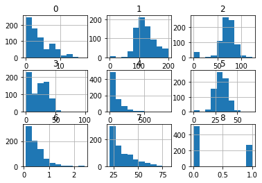
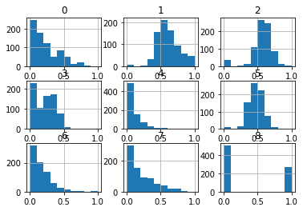
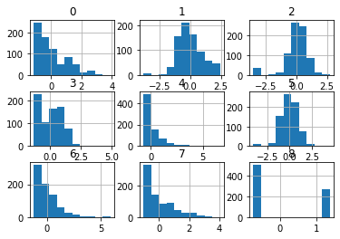
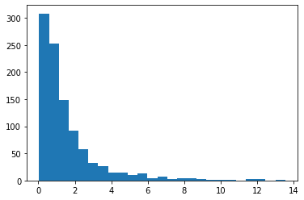
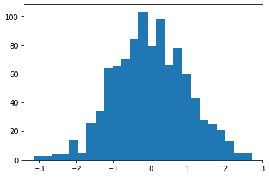

[Back](../../)
#### [Download Notebook](https://github.com/albergar2/data_science_material/blob/master/03_Data_Transformation.ipynb)


## 1. Normalization

Scales each variable between 0 and 1.


```python
import numpy as np
import pandas as pd
from sklearn.preprocessing import MinMaxScaler
from matplotlib import pyplot as plt
```


```python
data = pd.read_csv('data/numerical_input.csv', header=None)
fig = data.hist()
plt.show()
```


    

    


```python
scaler = MinMaxScaler()
scaled = scaler.fit_transform(data.values)
fig = pd.DataFrame(scaled).hist()
plt.show()
```


    

    


## 2. Standarization

Standardization for each variable subtracts the mean (centering) and divides by the standard deviation (scaling) changing the distribution to have a mean of zero and a standard deviation of one. (Standardization assumes that observations have a Gaussian distribution)


```python
import numpy as np
import pandas as pd
from sklearn.preprocessing import StandardScaler
from matplotlib import pyplot as plt
```


```python
data = pd.read_csv('data/numerical_input.csv', header=None)
fig = data.hist()
plt.show()
```


    

    


```python
scaler = StandardScaler()
scaled = scaler.fit_transform(data.values)
fig = pd.DataFrame(scaled).hist()
plt.show()
```


    

    


## 3. Transform to a Gaussian-like Distribution


```python
import numpy as np
from sklearn.preprocessing import PowerTransformer
from matplotlib import pyplot as plt

# generate gaussian data 
data = np.random.randn(1000)
data = data.reshape((len(data),1))

# add a skew to the data distribution
data = np.exp(data)
plt.hist(data, bins=25)
plt.show()

# power transform the raw data
#`yeo-johnson'--> when values are not always positive
#`box-cox'--> when the values are positive
power = PowerTransformer(method='box-cox')
data_trans = power.fit_transform(data)
plt.hist(data_trans, bins=25)
plt.show()
```


    

    


    

    


## 4. Polynomial Transformation

Polynomial features are those that are created by raising the existing variable to an exponent. For example, if a dataset has an input attribute of X, then a polynomial feature would be the addition of a new characteristic (column) where the values were calculated by squaring the values in X,  X2. Variables of grade 2 or 3 are usually added.


```python
from sklearn.preprocessing import PolynomialFeatures

data = np.asarray([[2,3],[4,5]])
print(data)

# perform a polynomial features transform of the dataset
trans = PolynomialFeatures(degree=2)
data = trans.fit_transform(data)
print(data)
```

    [[2 3]
     [4 5]]
    [[ 1.  2.  3.  4.  6.  9.]
     [ 1.  4.  5. 16. 20. 25.]]


## 5. Categorical Transformations

### 5.1 Ordinal Encoder


```python
from sklearn.preprocessing import OrdinalEncoder

data = np.asarray([['red'], ['green'], ['blue']])
print(data)

encoder = OrdinalEncoder()
result = encoder.fit_transform(data)
print(result)
```

    [['red']
     ['green']
     ['blue']]
    [[2.]
     [1.]
     [0.]]


### 5.2 One-Hot Encoder


```python
from sklearn.preprocessing import OneHotEncoder

data = np.asarray([['red'], ['green'], ['blue'], ['yellow']])
print(data)

#sparse:bool, default=True Will return sparse matrix if set True else will return an array.
encoder = OneHotEncoder(sparse=False)
result = encoder.fit_transform(data)
print(result)
```

    [['red']
     ['green']
     ['blue']
     ['yellow']]
    [[0. 0. 1. 0.]
     [0. 1. 0. 0.]
     [1. 0. 0. 0.]
     [0. 0. 0. 1.]]


```python

```
