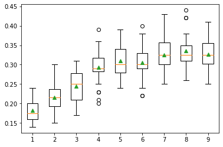
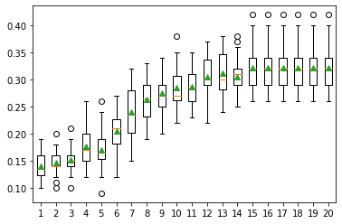
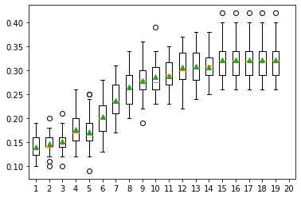

[Back](../../)
#### [Download Notebook](https://github.com/albergar2/data_science_material/blob/master/Dimensionality_Reduction.ipynb)


## 1. Linear Discriminant Analysis (LDA)

LDA is a predictive classification technique used when the groups or classes are known in advance before the classification is performed, which is different from decision trees where the classification groups are derived from the execution of the algorithm. It is a technique for predicting the group or class to which an observation belongs from certain features .

It is also a method of dimension reduction, given that by taking `n` independent variables from the dataset, the method takes `p <= n` new independent variables that most contribute to the separation of classes from the dependent variable.


```python
import numpy as np
from sklearn.datasets import make_classification
from sklearn.model_selection import cross_val_score
from sklearn.model_selection import RepeatedStratifiedKFold
from sklearn.pipeline import Pipeline
from sklearn.discriminant_analysis import LinearDiscriminantAnalysis
from sklearn.linear_model import LogisticRegression
from matplotlib import pyplot as plt

X, y = make_classification(n_samples=1000, n_features=20, n_informative=15, n_redundant=5, random_state=7, n_classes=10)

models = dict()
for i in range(1,10):
    steps = [('lda', LinearDiscriminantAnalysis(n_components=i)), ('m', LogisticRegression())]
    models[str(i)] = Pipeline(steps=steps)

# evaluate a given model using cross-validation
results, names = list(), list()
for name, model in models.items():
    cv = RepeatedStratifiedKFold(n_splits=10, n_repeats=3, random_state=1)
    scores = cross_val_score(model, X, y, scoring='accuracy', cv=cv, n_jobs=-1)  
    results.append(scores)
    names.append(name)
    print('Model with n=%s components: Accuracy %.3f STD(%.3f)' % (name, np.mean(scores), np.std(scores)))

plt.boxplot(results, labels=names, showmeans=True)
plt.show()
```

    Model with n=1 components: Accuracy 0.182 STD(0.027)
    Model with n=2 components: Accuracy 0.215 STD(0.033)
    Model with n=3 components: Accuracy 0.245 STD(0.037)
    Model with n=4 components: Accuracy 0.294 STD(0.043)
    Model with n=5 components: Accuracy 0.310 STD(0.043)
    Model with n=6 components: Accuracy 0.305 STD(0.042)
    Model with n=7 components: Accuracy 0.325 STD(0.046)
    Model with n=8 components: Accuracy 0.335 STD(0.043)
    Model with n=9 components: Accuracy 0.327 STD(0.038)


    

    


## 2. Principal Component Analysis (PCA)

PCA is a mathematical process that transforms a set of correlated variables into a set of uncorrelated variables called principal components.

The first main component represents the greatest possible amount of variability in the data and each subsequent component explains the remaining variability, the goal being to preserve the variance of the original data.


```python
import numpy as np
from sklearn.datasets import make_classification
from sklearn.model_selection import cross_val_score
from sklearn.model_selection import RepeatedStratifiedKFold
from sklearn.pipeline import Pipeline
from sklearn.decomposition import PCA
from sklearn.linear_model import LogisticRegression
from matplotlib import pyplot as plt

X, y = make_classification(n_samples=1000, n_features=20, n_informative=15, n_redundant=5, random_state=7, n_classes=10)

models = dict()
for i in range(1,21):
    steps = [('pca', PCA(n_components=i)), ('m', LogisticRegression())]
    models[str(i)] = Pipeline(steps=steps)

# evaluate a given model using cross-validation
results, names = list(), list()
for name, model in models.items():
    cv = RepeatedStratifiedKFold(n_splits=10, n_repeats=3, random_state=1)
    scores = cross_val_score(model, X, y, scoring='accuracy', cv=cv, n_jobs=-1)  
    results.append(scores)
    names.append(name)
    print('Model with n=%s components: Accuracy %.3f STD(%.3f)' % (name, np.mean(scores), np.std(scores)))

plt.boxplot(results, labels=names, showmeans=True)
plt.show()
```

    Model with n=1 components: Accuracy 0.140 STD(0.024)
    Model with n=2 components: Accuracy 0.147 STD(0.021)
    Model with n=3 components: Accuracy 0.152 STD(0.023)
    Model with n=4 components: Accuracy 0.176 STD(0.033)
    Model with n=5 components: Accuracy 0.171 STD(0.036)
    Model with n=6 components: Accuracy 0.205 STD(0.039)
    Model with n=7 components: Accuracy 0.240 STD(0.043)
    Model with n=8 components: Accuracy 0.263 STD(0.034)
    Model with n=9 components: Accuracy 0.274 STD(0.035)
    Model with n=10 components: Accuracy 0.285 STD(0.036)
    Model with n=11 components: Accuracy 0.287 STD(0.035)
    Model with n=12 components: Accuracy 0.305 STD(0.037)
    Model with n=13 components: Accuracy 0.311 STD(0.037)
    Model with n=14 components: Accuracy 0.306 STD(0.034)
    Model with n=15 components: Accuracy 0.323 STD(0.039)
    Model with n=16 components: Accuracy 0.323 STD(0.039)
    Model with n=17 components: Accuracy 0.323 STD(0.039)
    Model with n=18 components: Accuracy 0.323 STD(0.039)
    Model with n=19 components: Accuracy 0.323 STD(0.039)
    Model with n=20 components: Accuracy 0.323 STD(0.039)


    

    


## 3. Singular Value Decomposition (SVD)

SVD, could be the most popular technique for dimensionality reduction when there is sparse data (most of the values are zero). 

Ex: Recommendation systems


```python
import numpy as np
from sklearn.datasets import make_classification
from sklearn.model_selection import cross_val_score
from sklearn.model_selection import RepeatedStratifiedKFold
from sklearn.pipeline import Pipeline
from sklearn.decomposition import TruncatedSVD
from sklearn.linear_model import LogisticRegression
from matplotlib import pyplot as plt

X, y = make_classification(n_samples=1000, n_features=20, n_informative=15, n_redundant=5, random_state=7, n_classes=10)

models = dict()
for i in range(1,21):
    steps = [('pca', TruncatedSVD(n_components=i)), ('m', LogisticRegression())]
    models[str(i)] = Pipeline(steps=steps)

# evaluate a given model using cross-validation
results, names = list(), list()
for name, model in models.items():
    cv = RepeatedStratifiedKFold(n_splits=10, n_repeats=3, random_state=1)
    scores = cross_val_score(model, X, y, scoring='accuracy', cv=cv, n_jobs=-1)  
    results.append(scores)
    names.append(name)
    print('Model with n=%s components: Accuracy %.3f STD(%.3f)' % (name, np.mean(scores), np.std(scores)))

plt.boxplot(results, labels=names, showmeans=True)
plt.show()
```

    Model with n=1 components: Accuracy 0.140 STD(0.024)
    Model with n=2 components: Accuracy 0.147 STD(0.021)
    Model with n=3 components: Accuracy 0.152 STD(0.023)
    Model with n=4 components: Accuracy 0.177 STD(0.032)
    Model with n=5 components: Accuracy 0.171 STD(0.036)
    Model with n=6 components: Accuracy 0.204 STD(0.038)
    Model with n=7 components: Accuracy 0.236 STD(0.037)
    Model with n=8 components: Accuracy 0.265 STD(0.035)
    Model with n=9 components: Accuracy 0.279 STD(0.036)
    Model with n=10 components: Accuracy 0.288 STD(0.035)
    Model with n=11 components: Accuracy 0.289 STD(0.034)
    Model with n=12 components: Accuracy 0.306 STD(0.037)
    Model with n=13 components: Accuracy 0.309 STD(0.037)
    Model with n=14 components: Accuracy 0.308 STD(0.033)
    Model with n=15 components: Accuracy 0.323 STD(0.039)
    Model with n=16 components: Accuracy 0.323 STD(0.039)
    Model with n=17 components: Accuracy 0.323 STD(0.039)
    Model with n=18 components: Accuracy 0.323 STD(0.039)
    Model with n=19 components: Accuracy 0.323 STD(0.039)
    Model with n=20 components: Accuracy nan STD(nan)


    

    


```python

```
