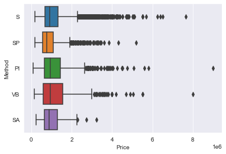

[Back](../../)
#### [Download Notebook](https://github.com/albergar2/data_science_material/blob/master/EDA_Guide.ipynb)


Reference: [11 Essential Code Blocks for Complete EDA (Exploratory Data Analysis)](https://towardsdatascience.com/11-simple-code-blocks-for-complete-exploratory-data-analysis-eda-67c2817f56cd)

Dataset: [Melobourne Housing Snapshot](https://www.kaggle.com/dansbecker/melbourne-housing-snapshot)


```python
import pandas as pd
pd.set_option('display.max_columns',100)

import numpy as np
import matplotlib.pyplot as plt
%matplotlib inline

import seaborn as sns
sns.set_style('darkgrid')
```


```python
data = pd.read_csv('data/melb_data.csv')
```

## 1. Shape


```python
data.shape
```


    (13580, 21)


## 2. Data types

We have to look for [variables definitions](https://datawrapper.dwcdn.net/hHuXG/4/). After understanding the data, we should look for numeric features that should be categorical and vice versa.


```python
data.dtypes
```


    Suburb            object
    Address           object
    Rooms              int64
    Type              object
    Price            float64
    Method            object
    SellerG           object
    Date              object
    Distance         float64
    Postcode         float64
    Bedroom2         float64
    Bathroom         float64
    Car              float64
    Landsize         float64
    BuildingArea     float64
    YearBuilt        float64
    CouncilArea       object
    Lattitude        float64
    Longtitude       float64
    Regionname        object
    Propertycount    float64
    dtype: object


## 3. Display a few rows

What to look out for:
- Can you understand the column names? Do they make sense?
- Do the values in these columns make sense?
- Are there significant missing values (NaN) sighted?
- What types of classes do the categorical features have?


```python
data.head()
```


<div>
<style scoped>
    .dataframe tbody tr th:only-of-type {
        vertical-align: middle;
    }

    .dataframe tbody tr th {
        vertical-align: top;
    }

    .dataframe thead th {
        text-align: right;
    }
</style>
<table border="1" class="dataframe">
  <thead>
    <tr style="text-align: right;">
      <th></th>
      <th>Suburb</th>
      <th>Address</th>
      <th>Rooms</th>
      <th>Type</th>
      <th>Price</th>
      <th>Method</th>
      <th>SellerG</th>
      <th>Date</th>
      <th>Distance</th>
      <th>Postcode</th>
      <th>Bedroom2</th>
      <th>Bathroom</th>
      <th>Car</th>
      <th>Landsize</th>
      <th>BuildingArea</th>
      <th>YearBuilt</th>
      <th>CouncilArea</th>
      <th>Lattitude</th>
      <th>Longtitude</th>
      <th>Regionname</th>
      <th>Propertycount</th>
    </tr>
  </thead>
  <tbody>
    <tr>
      <th>0</th>
      <td>Abbotsford</td>
      <td>85 Turner St</td>
      <td>2</td>
      <td>h</td>
      <td>1480000.0</td>
      <td>S</td>
      <td>Biggin</td>
      <td>3/12/2016</td>
      <td>2.5</td>
      <td>3067.0</td>
      <td>2.0</td>
      <td>1.0</td>
      <td>1.0</td>
      <td>202.0</td>
      <td>NaN</td>
      <td>NaN</td>
      <td>Yarra</td>
      <td>-37.7996</td>
      <td>144.9984</td>
      <td>Northern Metropolitan</td>
      <td>4019.0</td>
    </tr>
    <tr>
      <th>1</th>
      <td>Abbotsford</td>
      <td>25 Bloomburg St</td>
      <td>2</td>
      <td>h</td>
      <td>1035000.0</td>
      <td>S</td>
      <td>Biggin</td>
      <td>4/02/2016</td>
      <td>2.5</td>
      <td>3067.0</td>
      <td>2.0</td>
      <td>1.0</td>
      <td>0.0</td>
      <td>156.0</td>
      <td>79.0</td>
      <td>1900.0</td>
      <td>Yarra</td>
      <td>-37.8079</td>
      <td>144.9934</td>
      <td>Northern Metropolitan</td>
      <td>4019.0</td>
    </tr>
    <tr>
      <th>2</th>
      <td>Abbotsford</td>
      <td>5 Charles St</td>
      <td>3</td>
      <td>h</td>
      <td>1465000.0</td>
      <td>SP</td>
      <td>Biggin</td>
      <td>4/03/2017</td>
      <td>2.5</td>
      <td>3067.0</td>
      <td>3.0</td>
      <td>2.0</td>
      <td>0.0</td>
      <td>134.0</td>
      <td>150.0</td>
      <td>1900.0</td>
      <td>Yarra</td>
      <td>-37.8093</td>
      <td>144.9944</td>
      <td>Northern Metropolitan</td>
      <td>4019.0</td>
    </tr>
    <tr>
      <th>3</th>
      <td>Abbotsford</td>
      <td>40 Federation La</td>
      <td>3</td>
      <td>h</td>
      <td>850000.0</td>
      <td>PI</td>
      <td>Biggin</td>
      <td>4/03/2017</td>
      <td>2.5</td>
      <td>3067.0</td>
      <td>3.0</td>
      <td>2.0</td>
      <td>1.0</td>
      <td>94.0</td>
      <td>NaN</td>
      <td>NaN</td>
      <td>Yarra</td>
      <td>-37.7969</td>
      <td>144.9969</td>
      <td>Northern Metropolitan</td>
      <td>4019.0</td>
    </tr>
    <tr>
      <th>4</th>
      <td>Abbotsford</td>
      <td>55a Park St</td>
      <td>4</td>
      <td>h</td>
      <td>1600000.0</td>
      <td>VB</td>
      <td>Nelson</td>
      <td>4/06/2016</td>
      <td>2.5</td>
      <td>3067.0</td>
      <td>3.0</td>
      <td>1.0</td>
      <td>2.0</td>
      <td>120.0</td>
      <td>142.0</td>
      <td>2014.0</td>
      <td>Yarra</td>
      <td>-37.8072</td>
      <td>144.9941</td>
      <td>Northern Metropolitan</td>
      <td>4019.0</td>
    </tr>
  </tbody>
</table>
</div>


```python
data.tail()
```


<div>
<style scoped>
    .dataframe tbody tr th:only-of-type {
        vertical-align: middle;
    }

    .dataframe tbody tr th {
        vertical-align: top;
    }

    .dataframe thead th {
        text-align: right;
    }
</style>
<table border="1" class="dataframe">
  <thead>
    <tr style="text-align: right;">
      <th></th>
      <th>Suburb</th>
      <th>Address</th>
      <th>Rooms</th>
      <th>Type</th>
      <th>Price</th>
      <th>Method</th>
      <th>SellerG</th>
      <th>Date</th>
      <th>Distance</th>
      <th>Postcode</th>
      <th>Bedroom2</th>
      <th>Bathroom</th>
      <th>Car</th>
      <th>Landsize</th>
      <th>BuildingArea</th>
      <th>YearBuilt</th>
      <th>CouncilArea</th>
      <th>Lattitude</th>
      <th>Longtitude</th>
      <th>Regionname</th>
      <th>Propertycount</th>
    </tr>
  </thead>
  <tbody>
    <tr>
      <th>13575</th>
      <td>Wheelers Hill</td>
      <td>12 Strada Cr</td>
      <td>4</td>
      <td>h</td>
      <td>1245000.0</td>
      <td>S</td>
      <td>Barry</td>
      <td>26/08/2017</td>
      <td>16.7</td>
      <td>3150.0</td>
      <td>4.0</td>
      <td>2.0</td>
      <td>2.0</td>
      <td>652.0</td>
      <td>NaN</td>
      <td>1981.0</td>
      <td>NaN</td>
      <td>-37.90562</td>
      <td>145.16761</td>
      <td>South-Eastern Metropolitan</td>
      <td>7392.0</td>
    </tr>
    <tr>
      <th>13576</th>
      <td>Williamstown</td>
      <td>77 Merrett Dr</td>
      <td>3</td>
      <td>h</td>
      <td>1031000.0</td>
      <td>SP</td>
      <td>Williams</td>
      <td>26/08/2017</td>
      <td>6.8</td>
      <td>3016.0</td>
      <td>3.0</td>
      <td>2.0</td>
      <td>2.0</td>
      <td>333.0</td>
      <td>133.0</td>
      <td>1995.0</td>
      <td>NaN</td>
      <td>-37.85927</td>
      <td>144.87904</td>
      <td>Western Metropolitan</td>
      <td>6380.0</td>
    </tr>
    <tr>
      <th>13577</th>
      <td>Williamstown</td>
      <td>83 Power St</td>
      <td>3</td>
      <td>h</td>
      <td>1170000.0</td>
      <td>S</td>
      <td>Raine</td>
      <td>26/08/2017</td>
      <td>6.8</td>
      <td>3016.0</td>
      <td>3.0</td>
      <td>2.0</td>
      <td>4.0</td>
      <td>436.0</td>
      <td>NaN</td>
      <td>1997.0</td>
      <td>NaN</td>
      <td>-37.85274</td>
      <td>144.88738</td>
      <td>Western Metropolitan</td>
      <td>6380.0</td>
    </tr>
    <tr>
      <th>13578</th>
      <td>Williamstown</td>
      <td>96 Verdon St</td>
      <td>4</td>
      <td>h</td>
      <td>2500000.0</td>
      <td>PI</td>
      <td>Sweeney</td>
      <td>26/08/2017</td>
      <td>6.8</td>
      <td>3016.0</td>
      <td>4.0</td>
      <td>1.0</td>
      <td>5.0</td>
      <td>866.0</td>
      <td>157.0</td>
      <td>1920.0</td>
      <td>NaN</td>
      <td>-37.85908</td>
      <td>144.89299</td>
      <td>Western Metropolitan</td>
      <td>6380.0</td>
    </tr>
    <tr>
      <th>13579</th>
      <td>Yarraville</td>
      <td>6 Agnes St</td>
      <td>4</td>
      <td>h</td>
      <td>1285000.0</td>
      <td>SP</td>
      <td>Village</td>
      <td>26/08/2017</td>
      <td>6.3</td>
      <td>3013.0</td>
      <td>4.0</td>
      <td>1.0</td>
      <td>1.0</td>
      <td>362.0</td>
      <td>112.0</td>
      <td>1920.0</td>
      <td>NaN</td>
      <td>-37.81188</td>
      <td>144.88449</td>
      <td>Western Metropolitan</td>
      <td>6543.0</td>
    </tr>
  </tbody>
</table>
</div>


```python
data.sample(5)
```


<div>
<style scoped>
    .dataframe tbody tr th:only-of-type {
        vertical-align: middle;
    }

    .dataframe tbody tr th {
        vertical-align: top;
    }

    .dataframe thead th {
        text-align: right;
    }
</style>
<table border="1" class="dataframe">
  <thead>
    <tr style="text-align: right;">
      <th></th>
      <th>Suburb</th>
      <th>Address</th>
      <th>Rooms</th>
      <th>Type</th>
      <th>Price</th>
      <th>Method</th>
      <th>SellerG</th>
      <th>Date</th>
      <th>Distance</th>
      <th>Postcode</th>
      <th>Bedroom2</th>
      <th>Bathroom</th>
      <th>Car</th>
      <th>Landsize</th>
      <th>BuildingArea</th>
      <th>YearBuilt</th>
      <th>CouncilArea</th>
      <th>Lattitude</th>
      <th>Longtitude</th>
      <th>Regionname</th>
      <th>Propertycount</th>
    </tr>
  </thead>
  <tbody>
    <tr>
      <th>5028</th>
      <td>Preston</td>
      <td>171 Tyler St</td>
      <td>4</td>
      <td>h</td>
      <td>750000.0</td>
      <td>PI</td>
      <td>Barry</td>
      <td>30/07/2016</td>
      <td>8.8</td>
      <td>3072.0</td>
      <td>3.0</td>
      <td>2.0</td>
      <td>2.0</td>
      <td>500.0</td>
      <td>150.0</td>
      <td>1950.0</td>
      <td>Darebin</td>
      <td>-37.73200</td>
      <td>145.0209</td>
      <td>Northern Metropolitan</td>
      <td>14577.0</td>
    </tr>
    <tr>
      <th>5616</th>
      <td>South Yarra</td>
      <td>9/372 Toorak Rd</td>
      <td>1</td>
      <td>u</td>
      <td>411000.0</td>
      <td>S</td>
      <td>hockingstuart</td>
      <td>8/10/2016</td>
      <td>3.3</td>
      <td>3141.0</td>
      <td>1.0</td>
      <td>1.0</td>
      <td>1.0</td>
      <td>1369.0</td>
      <td>NaN</td>
      <td>NaN</td>
      <td>Stonnington</td>
      <td>-37.84050</td>
      <td>145.0025</td>
      <td>Southern Metropolitan</td>
      <td>14887.0</td>
    </tr>
    <tr>
      <th>4473</th>
      <td>Northcote</td>
      <td>43 Andrew St</td>
      <td>4</td>
      <td>h</td>
      <td>2004000.0</td>
      <td>S</td>
      <td>Jellis</td>
      <td>24/09/2016</td>
      <td>5.5</td>
      <td>3070.0</td>
      <td>3.0</td>
      <td>2.0</td>
      <td>1.0</td>
      <td>569.0</td>
      <td>NaN</td>
      <td>NaN</td>
      <td>Darebin</td>
      <td>-37.77200</td>
      <td>145.0039</td>
      <td>Northern Metropolitan</td>
      <td>11364.0</td>
    </tr>
    <tr>
      <th>9096</th>
      <td>Chelsea</td>
      <td>30 Mulkarra Dr</td>
      <td>3</td>
      <td>h</td>
      <td>840000.0</td>
      <td>S</td>
      <td>Ray</td>
      <td>3/06/2017</td>
      <td>27.0</td>
      <td>3196.0</td>
      <td>3.0</td>
      <td>2.0</td>
      <td>2.0</td>
      <td>534.0</td>
      <td>126.0</td>
      <td>1975.0</td>
      <td>Kingston</td>
      <td>-38.04683</td>
      <td>145.1261</td>
      <td>South-Eastern Metropolitan</td>
      <td>3906.0</td>
    </tr>
    <tr>
      <th>4757</th>
      <td>Port Melbourne</td>
      <td>9 The Cove</td>
      <td>3</td>
      <td>h</td>
      <td>1570000.0</td>
      <td>S</td>
      <td>Biggin</td>
      <td>17/09/2016</td>
      <td>3.8</td>
      <td>3207.0</td>
      <td>3.0</td>
      <td>2.0</td>
      <td>1.0</td>
      <td>210.0</td>
      <td>211.0</td>
      <td>1999.0</td>
      <td>Port Phillip</td>
      <td>-37.83820</td>
      <td>144.9272</td>
      <td>Southern Metropolitan</td>
      <td>8648.0</td>
    </tr>
  </tbody>
</table>
</div>


## 4. Numerical Features Distribution

What to look out for:
- Possible outliers that cannot be explained or might be measurement errors
- Numeric features that should be categorical. For example, Gender represented by 1 and 0.
- Boundaries that do not make sense such as percentage values> 100.


```python
data.hist(figsize=(14,14), xrot=45)
plt.show()
```


    

    


```python
data.describe()
```


<div>
<style scoped>
    .dataframe tbody tr th:only-of-type {
        vertical-align: middle;
    }

    .dataframe tbody tr th {
        vertical-align: top;
    }

    .dataframe thead th {
        text-align: right;
    }
</style>
<table border="1" class="dataframe">
  <thead>
    <tr style="text-align: right;">
      <th></th>
      <th>Rooms</th>
      <th>Price</th>
      <th>Distance</th>
      <th>Postcode</th>
      <th>Bedroom2</th>
      <th>Bathroom</th>
      <th>Car</th>
      <th>Landsize</th>
      <th>BuildingArea</th>
      <th>YearBuilt</th>
      <th>Lattitude</th>
      <th>Longtitude</th>
      <th>Propertycount</th>
    </tr>
  </thead>
  <tbody>
    <tr>
      <th>count</th>
      <td>13580.000000</td>
      <td>1.358000e+04</td>
      <td>13580.000000</td>
      <td>13580.000000</td>
      <td>13580.000000</td>
      <td>13580.000000</td>
      <td>13518.000000</td>
      <td>13580.000000</td>
      <td>7130.000000</td>
      <td>8205.000000</td>
      <td>13580.000000</td>
      <td>13580.000000</td>
      <td>13580.000000</td>
    </tr>
    <tr>
      <th>mean</th>
      <td>2.937997</td>
      <td>1.075684e+06</td>
      <td>10.137776</td>
      <td>3105.301915</td>
      <td>2.914728</td>
      <td>1.534242</td>
      <td>1.610075</td>
      <td>558.416127</td>
      <td>151.967650</td>
      <td>1964.684217</td>
      <td>-37.809203</td>
      <td>144.995216</td>
      <td>7454.417378</td>
    </tr>
    <tr>
      <th>std</th>
      <td>0.955748</td>
      <td>6.393107e+05</td>
      <td>5.868725</td>
      <td>90.676964</td>
      <td>0.965921</td>
      <td>0.691712</td>
      <td>0.962634</td>
      <td>3990.669241</td>
      <td>541.014538</td>
      <td>37.273762</td>
      <td>0.079260</td>
      <td>0.103916</td>
      <td>4378.581772</td>
    </tr>
    <tr>
      <th>min</th>
      <td>1.000000</td>
      <td>8.500000e+04</td>
      <td>0.000000</td>
      <td>3000.000000</td>
      <td>0.000000</td>
      <td>0.000000</td>
      <td>0.000000</td>
      <td>0.000000</td>
      <td>0.000000</td>
      <td>1196.000000</td>
      <td>-38.182550</td>
      <td>144.431810</td>
      <td>249.000000</td>
    </tr>
    <tr>
      <th>25%</th>
      <td>2.000000</td>
      <td>6.500000e+05</td>
      <td>6.100000</td>
      <td>3044.000000</td>
      <td>2.000000</td>
      <td>1.000000</td>
      <td>1.000000</td>
      <td>177.000000</td>
      <td>93.000000</td>
      <td>1940.000000</td>
      <td>-37.856822</td>
      <td>144.929600</td>
      <td>4380.000000</td>
    </tr>
    <tr>
      <th>50%</th>
      <td>3.000000</td>
      <td>9.030000e+05</td>
      <td>9.200000</td>
      <td>3084.000000</td>
      <td>3.000000</td>
      <td>1.000000</td>
      <td>2.000000</td>
      <td>440.000000</td>
      <td>126.000000</td>
      <td>1970.000000</td>
      <td>-37.802355</td>
      <td>145.000100</td>
      <td>6555.000000</td>
    </tr>
    <tr>
      <th>75%</th>
      <td>3.000000</td>
      <td>1.330000e+06</td>
      <td>13.000000</td>
      <td>3148.000000</td>
      <td>3.000000</td>
      <td>2.000000</td>
      <td>2.000000</td>
      <td>651.000000</td>
      <td>174.000000</td>
      <td>1999.000000</td>
      <td>-37.756400</td>
      <td>145.058305</td>
      <td>10331.000000</td>
    </tr>
    <tr>
      <th>max</th>
      <td>10.000000</td>
      <td>9.000000e+06</td>
      <td>48.100000</td>
      <td>3977.000000</td>
      <td>20.000000</td>
      <td>8.000000</td>
      <td>10.000000</td>
      <td>433014.000000</td>
      <td>44515.000000</td>
      <td>2018.000000</td>
      <td>-37.408530</td>
      <td>145.526350</td>
      <td>21650.000000</td>
    </tr>
  </tbody>
</table>
</div>


## 5. Categorical features

What to look out for:
- Sparse classes which have the potential to affect a model’s performance.
- Mistakes in labeling of the classes, for example 2 exact classes with minor spelling differences.


```python
data.describe(include='object')
```


<div>
<style scoped>
    .dataframe tbody tr th:only-of-type {
        vertical-align: middle;
    }

    .dataframe tbody tr th {
        vertical-align: top;
    }

    .dataframe thead th {
        text-align: right;
    }
</style>
<table border="1" class="dataframe">
  <thead>
    <tr style="text-align: right;">
      <th></th>
      <th>Suburb</th>
      <th>Address</th>
      <th>Type</th>
      <th>Method</th>
      <th>SellerG</th>
      <th>Date</th>
      <th>CouncilArea</th>
      <th>Regionname</th>
    </tr>
  </thead>
  <tbody>
    <tr>
      <th>count</th>
      <td>13580</td>
      <td>13580</td>
      <td>13580</td>
      <td>13580</td>
      <td>13580</td>
      <td>13580</td>
      <td>12211</td>
      <td>13580</td>
    </tr>
    <tr>
      <th>unique</th>
      <td>314</td>
      <td>13378</td>
      <td>3</td>
      <td>5</td>
      <td>268</td>
      <td>58</td>
      <td>33</td>
      <td>8</td>
    </tr>
    <tr>
      <th>top</th>
      <td>Reservoir</td>
      <td>5 Charles St</td>
      <td>h</td>
      <td>S</td>
      <td>Nelson</td>
      <td>27/05/2017</td>
      <td>Moreland</td>
      <td>Southern Metropolitan</td>
    </tr>
    <tr>
      <th>freq</th>
      <td>359</td>
      <td>3</td>
      <td>9449</td>
      <td>9022</td>
      <td>1565</td>
      <td>473</td>
      <td>1163</td>
      <td>4695</td>
    </tr>
  </tbody>
</table>
</div>


```python
for column in data.select_dtypes(include='object'):
    if data[column].nunique() < 10:
        sns.countplot(y=column, data=data)
        plt.show()
```


    

    


    

    


    

    


### 6. Segment the target variable by categorical features

What to look out for:
- Which classes most affect the target variables.


```python
for column in data.select_dtypes(include='object'):
    if data[column].nunique() < 10:
        sns.boxplot(y=column, x='Price', data=data)
        plt.show()
```


    

    


    

    


    

    


### 7. Group numeric features by each categorical feature


```python
for column in data.select_dtypes(include='object'):
    if data[column].nunique() < 10:
        display(data.groupby(column).mean())
```


<div>
<style scoped>
    .dataframe tbody tr th:only-of-type {
        vertical-align: middle;
    }

    .dataframe tbody tr th {
        vertical-align: top;
    }

    .dataframe thead th {
        text-align: right;
    }
</style>
<table border="1" class="dataframe">
  <thead>
    <tr style="text-align: right;">
      <th></th>
      <th>Rooms</th>
      <th>Price</th>
      <th>Distance</th>
      <th>Postcode</th>
      <th>Bedroom2</th>
      <th>Bathroom</th>
      <th>Car</th>
      <th>Landsize</th>
      <th>BuildingArea</th>
      <th>YearBuilt</th>
      <th>Lattitude</th>
      <th>Longtitude</th>
      <th>Propertycount</th>
    </tr>
    <tr>
      <th>Type</th>
      <th></th>
      <th></th>
      <th></th>
      <th></th>
      <th></th>
      <th></th>
      <th></th>
      <th></th>
      <th></th>
      <th></th>
      <th></th>
      <th></th>
      <th></th>
    </tr>
  </thead>
  <tbody>
    <tr>
      <th>h</th>
      <td>3.260874</td>
      <td>1.242665e+06</td>
      <td>10.979479</td>
      <td>3104.080643</td>
      <td>3.229336</td>
      <td>1.613822</td>
      <td>1.771222</td>
      <td>617.181924</td>
      <td>176.866248</td>
      <td>1954.081176</td>
      <td>-37.803795</td>
      <td>144.994700</td>
      <td>7259.025505</td>
    </tr>
    <tr>
      <th>t</th>
      <td>2.837522</td>
      <td>9.337351e+05</td>
      <td>9.851346</td>
      <td>3100.777379</td>
      <td>2.814183</td>
      <td>1.809695</td>
      <td>1.555655</td>
      <td>279.606822</td>
      <td>140.046323</td>
      <td>1998.988189</td>
      <td>-37.815782</td>
      <td>144.996489</td>
      <td>7094.459605</td>
    </tr>
    <tr>
      <th>u</th>
      <td>1.963871</td>
      <td>6.051275e+05</td>
      <td>7.607391</td>
      <td>3110.797481</td>
      <td>1.966523</td>
      <td>1.183295</td>
      <td>1.128358</td>
      <td>477.314219</td>
      <td>80.737121</td>
      <td>1980.016708</td>
      <td>-37.823710</td>
      <td>144.996363</td>
      <td>8199.280080</td>
    </tr>
  </tbody>
</table>
</div>


<div>
<style scoped>
    .dataframe tbody tr th:only-of-type {
        vertical-align: middle;
    }

    .dataframe tbody tr th {
        vertical-align: top;
    }

    .dataframe thead th {
        text-align: right;
    }
</style>
<table border="1" class="dataframe">
  <thead>
    <tr style="text-align: right;">
      <th></th>
      <th>Rooms</th>
      <th>Price</th>
      <th>Distance</th>
      <th>Postcode</th>
      <th>Bedroom2</th>
      <th>Bathroom</th>
      <th>Car</th>
      <th>Landsize</th>
      <th>BuildingArea</th>
      <th>YearBuilt</th>
      <th>Lattitude</th>
      <th>Longtitude</th>
      <th>Propertycount</th>
    </tr>
    <tr>
      <th>Method</th>
      <th></th>
      <th></th>
      <th></th>
      <th></th>
      <th></th>
      <th></th>
      <th></th>
      <th></th>
      <th></th>
      <th></th>
      <th></th>
      <th></th>
      <th></th>
    </tr>
  </thead>
  <tbody>
    <tr>
      <th>PI</th>
      <td>3.077366</td>
      <td>1.133242e+06</td>
      <td>9.482097</td>
      <td>3106.742327</td>
      <td>3.062660</td>
      <td>1.714194</td>
      <td>1.703918</td>
      <td>521.682864</td>
      <td>158.783107</td>
      <td>1965.621106</td>
      <td>-37.814429</td>
      <td>145.001865</td>
      <td>7749.644501</td>
    </tr>
    <tr>
      <th>S</th>
      <td>2.941809</td>
      <td>1.087327e+06</td>
      <td>10.431523</td>
      <td>3106.171359</td>
      <td>2.914875</td>
      <td>1.498781</td>
      <td>1.602581</td>
      <td>531.129905</td>
      <td>155.781647</td>
      <td>1963.382091</td>
      <td>-37.808204</td>
      <td>144.997012</td>
      <td>7496.049435</td>
    </tr>
    <tr>
      <th>SA</th>
      <td>3.010870</td>
      <td>1.025772e+06</td>
      <td>12.385870</td>
      <td>3132.304348</td>
      <td>3.010870</td>
      <td>1.554348</td>
      <td>1.769231</td>
      <td>699.532609</td>
      <td>151.454318</td>
      <td>1979.340000</td>
      <td>-37.818112</td>
      <td>145.023262</td>
      <td>6945.902174</td>
    </tr>
    <tr>
      <th>SP</th>
      <td>2.795655</td>
      <td>8.998924e+05</td>
      <td>10.374692</td>
      <td>3096.480916</td>
      <td>2.785672</td>
      <td>1.456254</td>
      <td>1.560472</td>
      <td>469.346447</td>
      <td>128.631366</td>
      <td>1968.742958</td>
      <td>-37.804809</td>
      <td>144.972983</td>
      <td>7093.759248</td>
    </tr>
    <tr>
      <th>VB</th>
      <td>2.924103</td>
      <td>1.166510e+06</td>
      <td>8.273728</td>
      <td>3107.337781</td>
      <td>2.896580</td>
      <td>1.675563</td>
      <td>1.602359</td>
      <td>927.331943</td>
      <td>152.419093</td>
      <td>1965.464807</td>
      <td>-37.815460</td>
      <td>145.002459</td>
      <td>7307.331943</td>
    </tr>
  </tbody>
</table>
</div>


<div>
<style scoped>
    .dataframe tbody tr th:only-of-type {
        vertical-align: middle;
    }

    .dataframe tbody tr th {
        vertical-align: top;
    }

    .dataframe thead th {
        text-align: right;
    }
</style>
<table border="1" class="dataframe">
  <thead>
    <tr style="text-align: right;">
      <th></th>
      <th>Rooms</th>
      <th>Price</th>
      <th>Distance</th>
      <th>Postcode</th>
      <th>Bedroom2</th>
      <th>Bathroom</th>
      <th>Car</th>
      <th>Landsize</th>
      <th>BuildingArea</th>
      <th>YearBuilt</th>
      <th>Lattitude</th>
      <th>Longtitude</th>
      <th>Propertycount</th>
    </tr>
    <tr>
      <th>Regionname</th>
      <th></th>
      <th></th>
      <th></th>
      <th></th>
      <th></th>
      <th></th>
      <th></th>
      <th></th>
      <th></th>
      <th></th>
      <th></th>
      <th></th>
      <th></th>
    </tr>
  </thead>
  <tbody>
    <tr>
      <th>Eastern Metropolitan</th>
      <td>3.322230</td>
      <td>1.104080e+06</td>
      <td>13.901088</td>
      <td>3111.162475</td>
      <td>3.313392</td>
      <td>1.698844</td>
      <td>1.792916</td>
      <td>634.133923</td>
      <td>178.001521</td>
      <td>1971.859903</td>
      <td>-37.788820</td>
      <td>145.129184</td>
      <td>5713.788579</td>
    </tr>
    <tr>
      <th>Eastern Victoria</th>
      <td>3.396226</td>
      <td>6.999808e+05</td>
      <td>34.209434</td>
      <td>3567.584906</td>
      <td>3.396226</td>
      <td>1.811321</td>
      <td>2.056604</td>
      <td>2949.698113</td>
      <td>183.645000</td>
      <td>1984.032258</td>
      <td>-37.959292</td>
      <td>145.324428</td>
      <td>8872.358491</td>
    </tr>
    <tr>
      <th>Northern Metropolitan</th>
      <td>2.755527</td>
      <td>8.981711e+05</td>
      <td>8.078329</td>
      <td>3071.360925</td>
      <td>2.734190</td>
      <td>1.367866</td>
      <td>1.454123</td>
      <td>568.948072</td>
      <td>124.177723</td>
      <td>1962.764286</td>
      <td>-37.747258</td>
      <td>144.981176</td>
      <td>9485.602057</td>
    </tr>
    <tr>
      <th>Northern Victoria</th>
      <td>3.560976</td>
      <td>5.948293e+05</td>
      <td>33.748780</td>
      <td>3418.707317</td>
      <td>3.560976</td>
      <td>1.853659</td>
      <td>1.925000</td>
      <td>3355.463415</td>
      <td>1746.374286</td>
      <td>1986.666667</td>
      <td>-37.599620</td>
      <td>144.838486</td>
      <td>4260.975610</td>
    </tr>
    <tr>
      <th>South-Eastern Metropolitan</th>
      <td>3.360000</td>
      <td>9.229438e+05</td>
      <td>23.813556</td>
      <td>3225.255556</td>
      <td>3.355556</td>
      <td>1.657778</td>
      <td>2.044444</td>
      <td>613.991111</td>
      <td>162.734296</td>
      <td>1976.859504</td>
      <td>-37.993727</td>
      <td>145.145865</td>
      <td>6589.366667</td>
    </tr>
    <tr>
      <th>Southern Metropolitan</th>
      <td>2.860916</td>
      <td>1.372963e+06</td>
      <td>8.756656</td>
      <td>3156.714590</td>
      <td>2.835144</td>
      <td>1.624068</td>
      <td>1.576264</td>
      <td>509.252183</td>
      <td>153.580962</td>
      <td>1960.523777</td>
      <td>-37.866981</td>
      <td>145.034312</td>
      <td>7622.279233</td>
    </tr>
    <tr>
      <th>Western Metropolitan</th>
      <td>3.023406</td>
      <td>8.664205e+05</td>
      <td>10.104579</td>
      <td>3031.781208</td>
      <td>2.990502</td>
      <td>1.501018</td>
      <td>1.696392</td>
      <td>493.606852</td>
      <td>144.697623</td>
      <td>1968.155192</td>
      <td>-37.782382</td>
      <td>144.862512</td>
      <td>5561.785957</td>
    </tr>
    <tr>
      <th>Western Victoria</th>
      <td>3.406250</td>
      <td>3.975234e+05</td>
      <td>30.753125</td>
      <td>3337.687500</td>
      <td>3.406250</td>
      <td>1.468750</td>
      <td>1.843750</td>
      <td>655.500000</td>
      <td>134.683810</td>
      <td>1982.565217</td>
      <td>-37.695163</td>
      <td>144.569906</td>
      <td>4191.156250</td>
    </tr>
  </tbody>
</table>
</div>


### 8. Correlations matrix for numerical features

What to look out for:
- Strongly correlated features; either dark red (positive) or dark blue(negative).
- Target variable; If it has strong positive or negative relationships with other features.


```python
corrs = data.corr()
plt.figure(figsize=(10,8))
sns.heatmap(corrs, cmap='RdBu_r', annot=True)
plt.show()
```


    

    


```python

```
