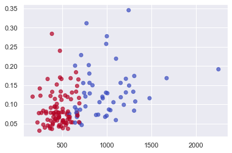

[Back](../../)
#### [Download Notebook](https://github.com/albergar2/data_science_material/blob/master/ML/unsupervised/02-knn.ipynb)


**K-Nearest Neighbour** algorithm is the simpliest ML algorithm. Also known as lazy learning (why? Because it does not create a generalized model during the time of training, so the testing phase is very important where it does the actual job. 

- **KNN classification**: the output is a class membership. An object is classified by a plurality vote of its neighbors, with the object being assigned to the class most common among its k nearest neighbors.
- **KNN regression**: the output is the property value for the object. This value is the average of the values of k nearest neighbors.

The distance measures for continious variables are:


In the instance of categorical variables, the Hamming distance must be used.


**How to choose the value of K**
K value is a hyperparameter which needs to choose during the time of model building. 
- Low K: low bias, high variance. 
- High K: smoother decision boundary --> low variance, high bias.

We should choose an odd number if the number of classes is even. **The most common values are to be 3 & 5**.


```python
import numpy as np
import pandas as pd
from matplotlib import pyplot as plt
from sklearn.datasets import load_breast_cancer
from sklearn.metrics import confusion_matrix
from sklearn.neighbors import KNeighborsClassifier
from sklearn.model_selection import train_test_split
import seaborn as sns
sns.set()
```

## 1. KNN Classifier

Tutorial: https://towardsdatascience.com/k-nearest-neighbor-python-2fccc47d2a55


```python
breast_cancer = load_breast_cancer()
X = pd.DataFrame(breast_cancer.data, columns=breast_cancer.feature_names)
X = X[['mean area', 'mean compactness']]
y = pd.Categorical.from_codes(breast_cancer.target, breast_cancer.target_names)
y = pd.get_dummies(y, drop_first=True)
```


```python
X.head()
```


<div>
<style scoped>
    .dataframe tbody tr th:only-of-type {
        vertical-align: middle;
    }

    .dataframe tbody tr th {
        vertical-align: top;
    }

    .dataframe thead th {
        text-align: right;
    }
</style>
<table border="1" class="dataframe">
  <thead>
    <tr style="text-align: right;">
      <th></th>
      <th>mean area</th>
      <th>mean compactness</th>
    </tr>
  </thead>
  <tbody>
    <tr>
      <th>0</th>
      <td>1001.0</td>
      <td>0.27760</td>
    </tr>
    <tr>
      <th>1</th>
      <td>1326.0</td>
      <td>0.07864</td>
    </tr>
    <tr>
      <th>2</th>
      <td>1203.0</td>
      <td>0.15990</td>
    </tr>
    <tr>
      <th>3</th>
      <td>386.1</td>
      <td>0.28390</td>
    </tr>
    <tr>
      <th>4</th>
      <td>1297.0</td>
      <td>0.13280</td>
    </tr>
  </tbody>
</table>
</div>


```python
y.head()
```


<div>
<style scoped>
    .dataframe tbody tr th:only-of-type {
        vertical-align: middle;
    }

    .dataframe tbody tr th {
        vertical-align: top;
    }

    .dataframe thead th {
        text-align: right;
    }
</style>
<table border="1" class="dataframe">
  <thead>
    <tr style="text-align: right;">
      <th></th>
      <th>benign</th>
    </tr>
  </thead>
  <tbody>
    <tr>
      <th>0</th>
      <td>0</td>
    </tr>
    <tr>
      <th>1</th>
      <td>0</td>
    </tr>
    <tr>
      <th>2</th>
      <td>0</td>
    </tr>
    <tr>
      <th>3</th>
      <td>0</td>
    </tr>
    <tr>
      <th>4</th>
      <td>0</td>
    </tr>
  </tbody>
</table>
</div>


```python
X_train, X_test, y_train, y_test = train_test_split(X, y.values.ravel(), random_state=1)
```


```python
knn = KNeighborsClassifier(n_neighbors=5, metric='euclidean')
knn.fit(X_train, y_train)
```


    KNeighborsClassifier(metric='euclidean')


```python
y_pred = knn.predict(X_test)
```


```python
plt.scatter(
    X_test['mean area'],
    X_test['mean compactness'],
    c=y_pred,
    cmap='coolwarm',
    alpha=0.7
)
```


    <matplotlib.collections.PathCollection at 0x7fd4619beb80>


    

    


```python
confusion_matrix(y_test, y_pred)
```


    array([[42, 13],
           [ 9, 79]])


## 2. KNN Regression

Tutorial: https://medium.com/analytics-vidhya/k-neighbors-regression-analysis-in-python-61532d56d8e4


```python
import mglearn 
from sklearn.neighbors import KNeighborsRegressor
```


```python
X, y = mglearn.datasets.make_wave(n_samples=40)
```


```python
X_train, X_test, y_train, y_test = train_test_split(X, y, random_state=0)
```


```python
reg = KNeighborsRegressor(n_neighbors=3, metric='minkowski')
reg.fit(X_train, y_train)
```


    KNeighborsRegressor(n_neighbors=3)


```python
print(reg.score(X_test, y_test))
```

    0.8344172446249605


```python

```


```python

```
